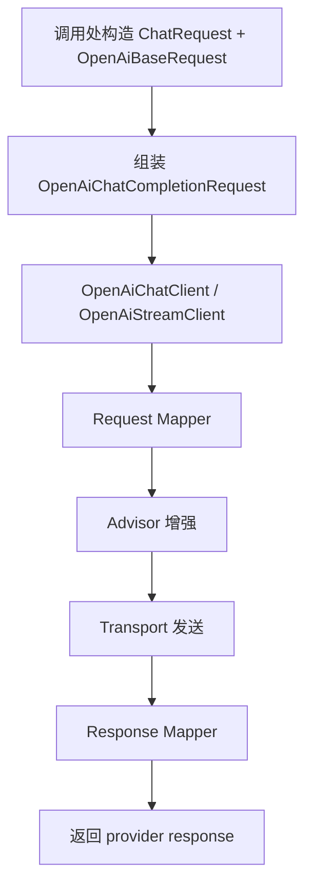
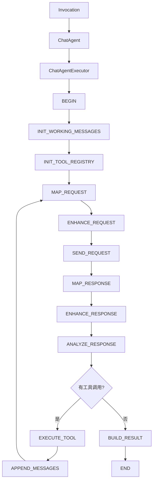
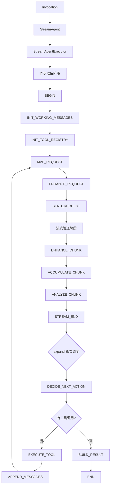

# liteagent-template

`liteagent-template` 是一个面向 AI Agent / LLM 调用场景的轻量级 Java 框架。
提供 provider 直调、工具注册与自动执行、多轮 agent 编排（同步 chat + 流式 stream）等完整能力。

## 当前状态

已经完成的内容：

- `liteagent-core`：统一消息模型、请求抽象、结果抽象、工具注册与执行规范
- `liteagent-provider-openai`：OpenAI-compatible 普通对话、流式对话、请求增强、运行时配置
- `liteagent-agent`：通用执行器、步骤模型、上下文、hook（同步 chat + 流式 stream 双路径）
- `liteagent-provider-openai-agent`：OpenAI 同步编排 + 流式编排，含完整工具执行闭环
- `liteagent-examples`：基于 Spring Boot 配置的本地验证示例，覆盖全部用法

还未完成的内容：

- Spring 自动装配增强
- 更多 provider 适配

## 模块结构

```text
liteagent-template
├─ liteagent-core
├─ liteagent-agent
├─ liteagent-provider-openai
├─ liteagent-provider-openai-agent
└─ liteagent-examples
```

## 三条主线

### 1. provider 直调主线



### 2. chatAgent 编排主线（同步）



### 3. streamAgent 编排主线（流式）



说明：

- `liteagent-provider-openai` 负责单轮 provider 能力
- `liteagent-provider-openai-agent` 负责把 OpenAI 单轮能力装配为可编排步骤链（同步 + 流式）
- chat 编排使用 key-based 步骤推进，`while (currentKey != END)` 循环；含工具执行回环
- stream 编排使用三阶段设计：同步准备 → Flux 管道构建 → `expand` 轮次调度；含工具执行回环
- 工具通过 `OpenAiRegistryToolsAdvisor` 作为 request advisor 注入，agent 运行时自动提取并执行

## 模块职责

### liteagent-core

只放稳定抽象和通用模型，不放供应商私有字段。
包含工具注册规范（`ToolRegistry`、`ToolRegistrar`）、工具执行规范（`ToolExecutor`）、工具模型（`ToolCall`、`FunctionCall`）。

### liteagent-agent

只放编排抽象，不放 provider 协议实现。
包含 chat（同步）和 stream（流式）两套并行的编排路径。
步骤 key 枚举包含完整工具回环步骤：`EXECUTE_TOOL`、`APPEND_MESSAGES`、`INIT_TOOL_REGISTRY`。

### liteagent-provider-openai

负责 OpenAI-compatible 协议的请求映射、响应映射、HTTP 调用和请求增强。

### liteagent-provider-openai-agent

负责把 OpenAI provider 的 mapper、advisor、transport、response mapper 组装为步骤执行链。
包含 chat（同步）和 stream（流式）两套 provider 步骤实现，均含完整工具执行闭环和多轮编排。

### liteagent-examples

负责本地 smoke test 和用法示例。
覆盖 provider 直调、agent 编排（含工具调用）、hook、QuickRequest 等全部用法。

## 文档

- [Quick Start](./docs/quick-start.md)
- [OpenAI-compatible Chat](./docs/openai-compatible-chat.md)
- [liteagent-core](./liteagent-core/README.md)
- [liteagent-agent](./liteagent-agent/README.md)
- [liteagent-provider-openai](./liteagent-provider-openai/README.md)
- [liteagent-provider-openai-agent](./liteagent-provider-openai-agent/README.md)
- [liteagent-examples](./liteagent-examples/README.md)

## 建议后续顺序

1. Spring 自动配置增强
2. 扩展更多 provider 适配
3. 更完善的异常细分与重试策略
4. 更细粒度的 provider 配置抽象
