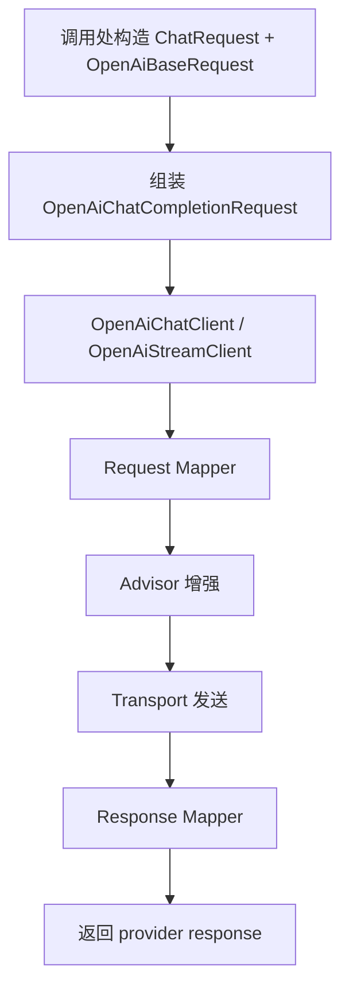
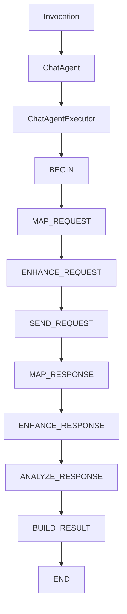
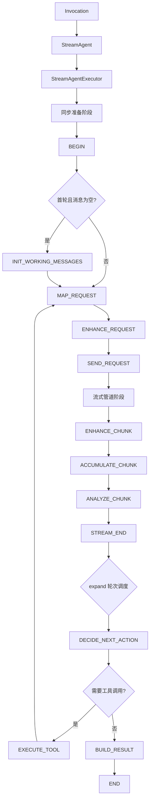

# liteagent-template

`liteagent-template` 是一个面向 AI Agent / LLM 调用场景的轻量级 Java 框架骨架。
当前目标是先把 provider 调用层、工具注入层和最小 agent 编排层拆清楚，再逐步补全工具闭环与多轮执行。

## 当前状态

已经完成的内容：

- `liteagent-core`：统一消息模型、请求抽象、结果抽象、工具注册规范
- `liteagent-provider-openai`：OpenAI-compatible 普通对话、流式对话、请求增强、运行时配置
- `liteagent-agent`：通用执行器、步骤模型、上下文、hook 骨架（同步 chat + 流式 stream 双路径）
- `liteagent-provider-openai-agent`：OpenAI 最小同步编排 + 流式编排骨架
- `liteagent-examples`：基于 Spring Boot 配置的本地验证示例

还未完成的内容：

- 工具自动执行闭环
- 多轮 agent 编排
- 响应增强器
- Spring 自动装配增强
- 更多 provider 适配

## 模块结构

```text
liteagent-template
├─ liteagent-core
├─ liteagent-agent
├─ liteagent-provider-openai
├─ liteagent-provider-openai-agent
└─ liteagent-examples
```

## 三条主线

### 1. provider 直调主线



### 2. chatAgent 编排主线（同步）



### 3. streamAgent 编排主线（流式）



说明：

- `liteagent-provider-openai` 负责单轮 provider 能力
- `liteagent-provider-openai-agent` 负责把 OpenAI 单轮能力装配为可编排步骤链（同步 + 流式）
- chat 编排使用 key-based 步骤推进，`while (currentKey != END)` 循环
- stream 编排使用三阶段设计：同步准备 → Flux 管道构建 → `expand` 轮次调度

## 模块职责

### liteagent-core

只放稳定抽象和通用模型，不放供应商私有字段。

### liteagent-agent

只放编排抽象，不放 provider 协议实现。
包含 chat（同步）和 stream（流式）两套并行的编排路径。

### liteagent-provider-openai

负责 OpenAI-compatible 协议的请求映射、响应映射、HTTP 调用和请求增强。

### liteagent-provider-openai-agent

负责把 OpenAI provider 的 mapper、advisor、transport、response mapper 组装为步骤执行链。
包含 chat（同步）和 stream（流式）两套 provider 步骤实现。

### liteagent-examples

负责本地 smoke test 和用法示例。
当前覆盖 provider 直调和 agent 编排两种用法。

## 文档

- [Quick Start](./docs/quick-start.md)
- [OpenAI-compatible Chat](./docs/openai-compatible-chat.md)
- [liteagent-core](./liteagent-core/README.md)
- [liteagent-agent](./liteagent-agent/README.md)
- [liteagent-provider-openai](./liteagent-provider-openai/README.md)
- [liteagent-provider-openai-agent](./liteagent-provider-openai-agent/README.md)
- [liteagent-examples](./liteagent-examples/README.md)

## 建议后续顺序

1. 完善工具自动执行闭环
2. 补多轮 agent 编排
3. 接入响应增强器
4. 再做 Spring 自动配置
5. 再扩展更多 provider
