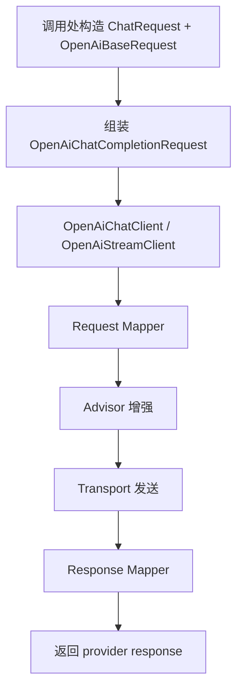
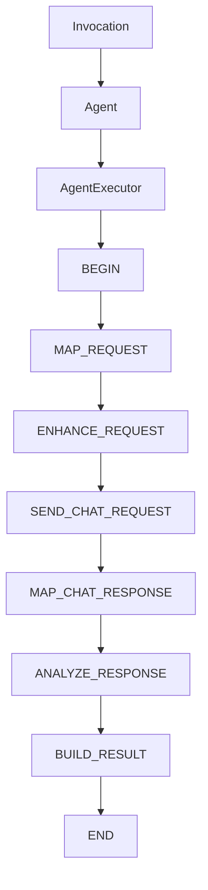

# liteagent-template

`liteagent-template` 是一个面向 AI Agent / LLM 调用场景的轻量级 Java 框架骨架。
当前目标是先把 provider 调用层、工具注入层和最小 agent 编排层拆清楚，再逐步补全工具闭环与多轮执行。

## 当前状态

已经完成的内容：

- `liteagent-core`：统一消息模型、请求抽象、结果抽象、工具注册规范
- `liteagent-provider-openai`：OpenAI-compatible 普通对话、流式对话、请求增强、运行时配置
- `liteagent-agent`：通用执行器、步骤模型、上下文、hook 骨架
- `liteagent-provider-openai-agent`：OpenAI 最小同步编排骨架
- `liteagent-examples`：基于 Spring Boot 配置的本地验证示例

还未完成的内容：

- 工具自动执行闭环
- 多轮 agent 编排
- 响应增强器
- 流式 agent 编排
- Spring 自动装配增强
- 更多 provider 适配

## 模块结构

```text
liteagent-template
├─ liteagent-core
├─ liteagent-agent
├─ liteagent-provider-openai
├─ liteagent-provider-openai-agent
└─ liteagent-examples
```

## 两条主线

### 1. provider 直调主线



### 2. agent 编排主线



说明：

- `liteagent-provider-openai` 负责单轮 provider 能力
- `liteagent-provider-openai-agent` 负责把 OpenAI 单轮能力装配为可编排步骤链
- 当前 `openai-agent` 只支持最小同步 chat 编排，不含工具自动执行回环

## 模块职责

### liteagent-core

只放稳定抽象和通用模型，不放供应商私有字段。

### liteagent-agent

只放编排抽象，不放 provider 协议实现。

### liteagent-provider-openai

负责 OpenAI-compatible 协议的请求映射、响应映射、HTTP 调用和请求增强。

### liteagent-provider-openai-agent

负责把 OpenAI provider 的 mapper、advisor、transport、response mapper 组装为步骤执行链。

### liteagent-examples

负责本地 smoke test 和用法示例。
当前主要覆盖 provider 直调，不把它当成框架正式 API 的一部分。

## 文档

- [Quick Start](./docs/quick-start.md)
- [OpenAI-compatible Chat](./docs/openai-compatible-chat.md)
- [liteagent-core](./liteagent-core/README.md)
- [liteagent-agent](./liteagent-agent/README.md)
- [liteagent-provider-openai](./liteagent-provider-openai/README.md)
- [liteagent-provider-openai-agent](./liteagent-provider-openai-agent/README.md)
- [liteagent-examples](./liteagent-examples/README.md)

## 建议后续顺序

1. 完善工具自动执行闭环
2. 补多轮 agent 编排
3. 接入响应增强器
4. 补流式 agent 编排
5. 再做 Spring 自动配置
6. 再扩展更多 provider
