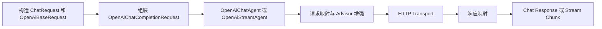
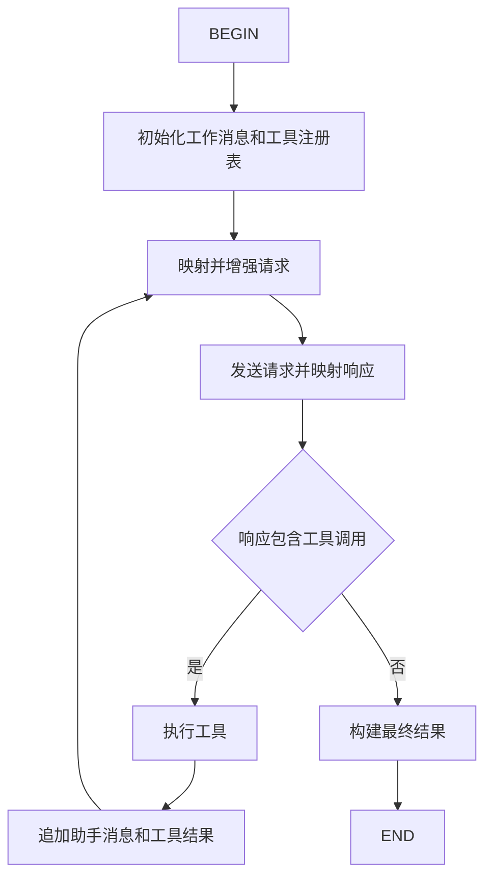
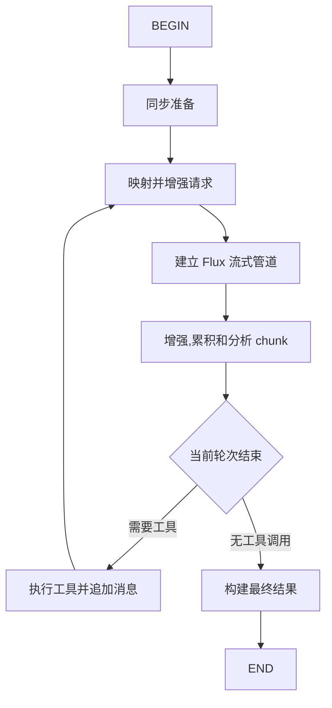

# liteagent-template

Spring AI 把工具调用循环封装在 ChatModel 内部，中间过程不可见也不可改（[Issue #4997](https://github.com/spring-projects/spring-ai/issues/4997)）。当你需要监控每轮工具调用的请求参数、在步骤之间插入自定义逻辑、或控制编排流程时，很难介入。

`liteagent-template` 是一个基于 Java 17 的轻量级 LLM / Agent 调用框架。核心思路是把 Agent 编排拆成独立步骤，注册到 Map 里，每步返回值决定下一步——所有步骤可替换、可插拔，编排上下文全程可读写。

当前版本为 `1.0.0`（由父 POM `${revision}` 属性统一管理）。

## Maven 依赖

在 `pom.xml` 中添加所需模块：

```xml
<dependency>
    <groupId>io.github.halcyonsong</groupId>
    <artifactId>liteagent-provider-openai-agent</artifactId>
    <version>1.0.0</version>
</dependency>
<dependency>
    <groupId>io.github.halcyonsong</groupId>
    <artifactId>liteagent-memory</artifactId>
    <version>1.0.0</version>
</dependency>
```

`liteagent-provider-openai-agent` 会自动引入 `liteagent-provider-openai`、`liteagent-agent` 和 `liteagent-core`。

> **重要**：使用 `@ToolParam` 注解的工具方法需要编译时保留参数名。请在 `pom.xml` 的 `maven-compiler-plugin` 中配置 `<parameters>true</parameters>`，或在每个 `@ToolParam` 中显式指定 `name` 属性。

## 推荐入口

首次接入或需要组合 Agent、工具调用和会话记忆时，优先阅读 [推荐调用方式](./docs/quickstart.md)。该文档只保留普通 Java 场景下的推荐完整路径；各模块的全部 API、低层扩展方式和更多示例见下方模块文档。

## 能力概览

- 同步 Chat 与流式 Stream 调用
- OpenAI-compatible 请求与响应映射
- 统一消息、请求、响应和工具调用模型
- 注解式工具注册、工具描述生成与自动执行
- 同步 Chat Agent 与流式 Stream Agent 编排
- 工具调用后的消息追加与多轮请求回环
- 请求与响应增强器（Advisor）
- 会话记忆窗口，支持跨请求的历史消息加载与写回
- 步骤 Hook，用于观察编排过程
- 基于 Spring Boot 配置的可运行调用示例

## 模块结构

```text
liteagent-template
├─ liteagent-core
├─ liteagent-agent
├─ liteagent-provider-openai
├─ liteagent-provider-openai-agent
├─ liteagent-memory
└─ liteagent-examples
```

| 模块 | 职责 |
|---|---|
| `liteagent-core` | 提供稳定的通用抽象：消息、请求、响应、工具注册和工具执行规范；不包含供应商私有协议字段。 |
| `liteagent-agent` | 提供与供应商无关的同步和流式 Agent 编排抽象，包括执行器、步骤、上下文与 Hook。 |
| `liteagent-provider-openai` | 实现 OpenAI-compatible 协议的请求映射、响应映射、HTTP 传输和 Advisor 扩展。 |
| `liteagent-provider-openai-agent` | 将 OpenAI provider 能力组装为同步与流式 Agent 步骤链，并处理工具调用回环。 |
| `liteagent-memory` | 提供会话记忆窗口，通过 StepHook 在编排开始时加载历史消息、结束时折叠写回；支持内存实现和持久化扩展。 |
| `liteagent-examples` | 作为可运行调用文档，展示请求构造、Agent 创建、工具接入、流式消费与输出打印；不承担框架功能断言测试。 |

## 调用路径

### 单轮 OpenAI 调用



`OpenAiChatAgents.create(...)` 创建同步 Agent，`OpenAiStreamAgents.create(...)` 创建流式 Agent。也可以通过对应的 `builder()` 入口统一配置运行时参数、Hook 与迭代上限。

### 同步 Agent 编排



同步编排由 key-based 步骤推进。模型请求工具时，执行器运行已注册工具，将结果写回工作消息，再发起下一轮调用。

### 流式 Agent 编排



流式编排先建立单轮 Flux 管道，再在轮次结束后判断是否需要执行工具和继续请求。调用方可逐个消费内容、reasoning 和工具调用增量。

## 工具调用

工具使用 `@ToolComponent`、`@ToolMethod` 和 `@ToolParam` 声明，通过 `ToolRegistries.inMemory(...)` 注册。将 `OpenAiRegistryToolsAdvisor` 添加到请求后，框架会把工具描述传给模型；Agent 在模型返回工具调用时自动执行工具，并将工具结果带入下一轮消息。

需要强制或限制模型的工具选择时，可组合 `OpenAiToolChoiceAdvisor`。

## 示例模块

`liteagent-examples` 中的每个类都围绕一种调用方式展开，重点展示完整代码路径而不是校验内部实现。示例包括：

- 同步对话、流式对话与 reasoning 输出
- 工具注册、工具选择和多轮工具调用
- 同步与流式 Agent
- Step Hook
- `OpenAiQuickChatRequest` 快捷请求构造
- 统一打印普通内容、思考内容、工具调用、流式增量、结束原因与 usage

示例需要通过 `liteagent-examples` 的 Spring Boot 配置提供 Base URL、API Key 和模型名；缺少配置时会跳过外部调用。

## 构建

在仓库根目录执行：

```bash
mvn clean test-compile
```

仅编译示例模块及其依赖：

```bash
mvn -pl liteagent-examples -am clean test-compile
```

示例以 JUnit 测试方法作为便捷运行入口。运行单个示例前，请先配置有效的 OpenAI-compatible 服务地址、API Key 和模型。

## 文档

- [推荐调用方式](./docs/quickstart.md)
- [核心抽象](./docs/liteagent-core.md)
- [Agent 编排](./docs/liteagent-agent.md)
- [OpenAI-compatible Provider](./docs/liteagent-provider-openai.md)
- [OpenAI Agent Provider](./docs/liteagent-provider-openai-agent.md)
- [记忆窗口](./docs/liteagent-memory.md)
- [调用示例](./liteagent-examples/README.md)

## 后续方向

- Spring Boot 自动配置与 Starter 支持
- 更多模型 Provider 适配
- 更细粒度的异常分类、重试和观测能力
- 更灵活的 Provider 配置抽象
