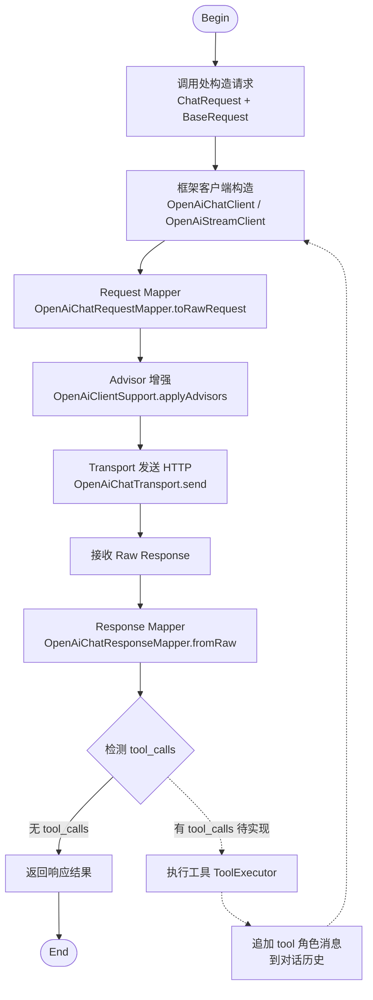
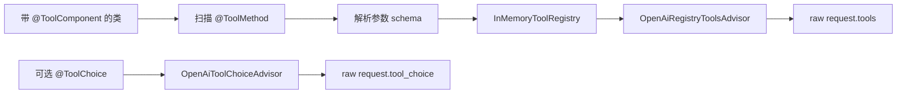

# liteagent-template

`liteagent-template` 是一个面向 AI Agent / LLM 调用场景的轻量级 Java 框架骨架。
当前重点不是做完整的 Agent 编排，而是先把稳定、清晰、可扩展的模型调用基础层搭起来。

## 当前状态

已经完成的内容：

- core 统一消息模型、请求模型、响应模型
- provider 分层的 request / raw request / response / raw response 结构
- OpenAI-compatible 普通对话调用
- OpenAI-compatible 流式对话调用
- OpenAI-compatible 扩展字段保留：`reasoning_content`、`tool_calls`、扩展 `usage`
- 基础运行时配置与 WebClient 复用
- 普通请求与流式请求分离的调用链
- 工具注册注解与注册器骨架
- provider 侧的 tools / tool_choice 请求增强器
- examples 模块的 Spring Boot 本地验证

暂未完全展开的内容：

- 工具自动执行闭环
- 多轮 agent 编排
- 更完整的错误码体系
- Spring 自动装配增强
- 更多 provider 适配

## 模块结构

```text
liteagent-template
├─ liteagent-core
├─ liteagent-provider-openai
└─ liteagent-examples
```

## 调用链路

普通请求与工具调用链路的完整流程：



说明：

- 实线部分为当前已实现的链路
- 虚线部分为工具执行闭环，尚未实现
- Advisor 增强阶段会遍历 `OpenAiChatCompletionRequest.advisors` 列表，依次执行 `enhance()`
- `OpenAiRegistryToolsAdvisor` 负责将 `ToolRegistry` 中的工具注入 `raw request.tools`
- `OpenAiToolChoiceAdvisor` 负责注入 `raw request.tool_choice`

## 模块职责

### liteagent-core

只放稳定的抽象和通用模型，不放供应商私有字段。

主要内容：

- `message`：消息抽象和消息构造器
- `model.request`：统一请求模型
- `model.response.chat`：统一普通响应模型
- `model.response.stream`：统一流式响应模型
- `tool`：工具注册规范与注解
- `exception`：框架基础异常

### liteagent-provider-openai

OpenAI-compatible 协议实现层。

主要内容：

- request / raw request / mapper
- response / raw response / mapper
- 普通 client / 流式 client
- transport
- runtime 配置与注册表
- tools / tool_choice 请求增强

### liteagent-examples

示例和本地验证模块。

主要用途：

- Spring Boot 配置读取
- 普通调用验证
- 流式调用验证
- 工具调用验证
- provider 特性验证

## 当前设计原则

### 1. core 与 provider 分离

core 只保留跨供应商共用的结构。

例如：

- `ChatRequest` 只放消息和通用选项
- `ChatOptions` 只放通用控制项
- `reasoning_content`、`tool_calls`、provider 扩展 `usage` 留在 provider 层

### 2. raw 与 wrapper 分层

请求和响应都分两层：

- wrapper：面向框架开发者
- raw：面向协议发送和接收

### 3. 普通与流式分离

普通请求和流式请求使用不同 client / transport：

- `OpenAiChatClient`
- `OpenAiStreamClient`

这样返回类型更稳定，链路也更容易维护。

### 4. 工具注册采用注解 + 注册器

当前工具注册链路是：



意思是：

- `InMemoryToolRegistry` 只是注册容器
- `OpenAiRegistryToolsAdvisor` 才是真正把 tools 注入请求的一步
- `OpenAiToolChoiceAdvisor` 负责工具选择策略注入
- 工具执行闭环和下一轮自动请求还没有做

## 快速开始

### 1. 构建项目

```bash
mvn clean test
```

### 2. 配置 examples

`liteagent-examples` 使用 `application.yaml` 作为主配置，并通过副配置文件覆盖本地密钥。

推荐结构：

```yaml
spring:
  config:
    import: optional:classpath:application-local.yaml
```

### 3. 运行示例测试

在 `liteagent-examples` 中执行测试即可验证：

- 普通 chat
- provider chat
- 普通 stream
- provider stream
- tools 注入
- tool_choice 注入

## 文档

- [Quick Start](./docs/quick-start.md)
- [OpenAI-compatible Chat](./docs/openai-compatible-chat.md)

## 后续顺序

建议后面按这个顺序继续：

1. 完善工具调用闭环
2. 再补 agent 编排
3. 再补 Spring 自动配置
4. 再扩展更多 provider
