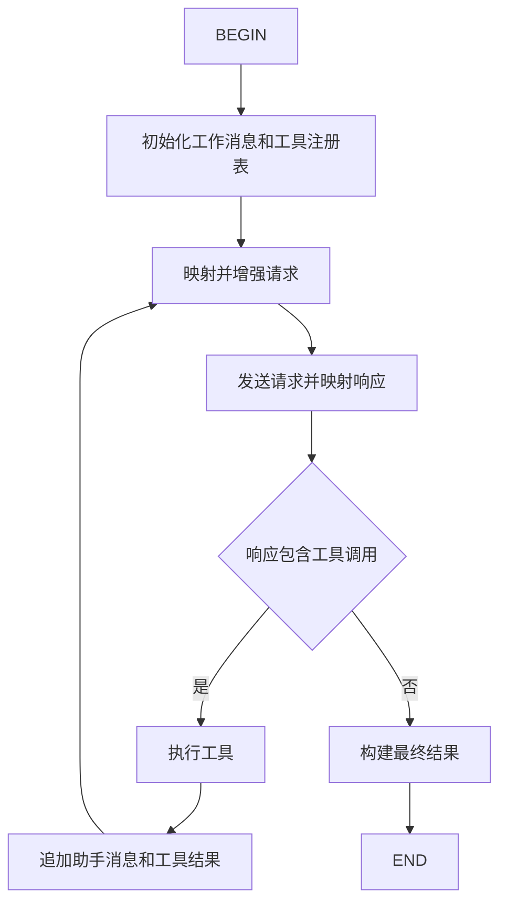
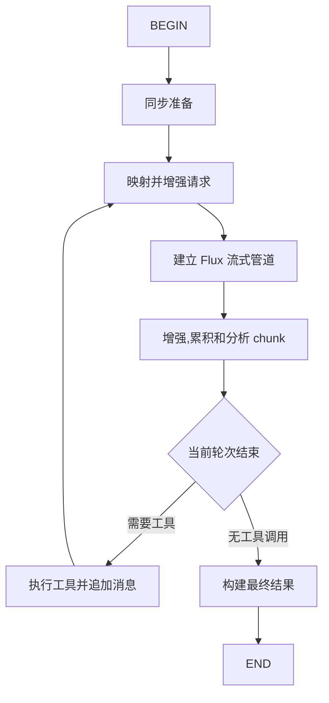

# SpringAI 两个月后，我尝试自己实现了一套 Agent 编排框架

## 背景介绍

之前打算用 Spring AI 做一个类似 Codex 的 Agent 工作台，需要动态配置模型参数、管理多轮会话记忆、监控工具调用链路等能力。做的时候发现 Spring AI 的高度封装模式使得这些需求都变得难以实现，起码实现的复杂度很高。LangChain4j 也类似，`AiServices` 声明式代理把编排藏在内部。这使得要非常细致地监控每一个调用节点变得异常困难。

作为一位编程小白，理解并记忆 LangGraph 图式编排的复杂规则还是稍显艰难，于是，一方面出于实际需求，更多是出于兴趣，我尝试从零设计了一个轻量级的 Agent 编排框架：**LiteAgent**。坦白说，它肯定还无法替代 Spring AI 等这些经过企业生产级验证的优秀框架，但是也能提供一个新的 agent 编排设计思路——把编排过程暴露出来，让开发者自己控制。

## 痛点分析

### 1. 工具调用循环完全封装，外部不可见

这是最核心的问题。Spring AI 的工具调用是 `ChatModel` 内部的私有递归——模型调了工具，工具返回了结果，然后 Spring AI 自动发下一轮请求。外部只能拿到最终结果，**中间循环了多少次、模型对于工具调用的请求参数是什么、每次工具执行返回了什么结果、下一轮请求带了什么参数，全都看不到**。

这不单纯是我使用的主观感受，Spring AI 团队自己也承认了。GitHub Issue #4997 的标题就是：

> "Move Tool Execution from ChatModel Internal Recursion to ChatClient Advisor Layer"

原文写道："The current architecture implements tool calling as internal recursion within ChatModel implementations, which causes several critical issues"——包括"Tool Call Messages Are Lost"（中间消息丢失）和无法观测、无法组合的问题。这同时也让实现工具调用请求的审计批准变得困难。

Spring AI 2.0 通过 Recursive Advisors 部分改善了可观测性，但工具调用仍然在 `ChatModel` 内部递归执行。Advisor 可以"observe and intercept every iteration"，但仍然不能完全自定义编排步骤。

LangChain4j 也一样，`AiServices` 声明式代理把工具调用和后续请求都藏在内部，有 `ChatModelListener` 可以监听，但不能干预中间流程。

### 2. 动态配置受限

Spring AI 官方推荐的配置方式是通过 `application.yaml` 在启动时预配置 `ChatOptions`（model、temperature、topP 等）。运行时想动态修改这些参数，`ChatClient` 虽然可以通过 `.prompt().system()` 动态覆盖部分配置，但 `ChatOptions` 的验证发生在启动阶段而不是运行时——动态传参时经常遇到约束冲突。

Spring AI 官方 GitHub 有 Issue #3404 在讨论"make ChatOptions runtime-validated instead of required at startup"，说明这个限制确实存在。

### 3. 记忆窗口缺少回退能力

Spring AI 提供了 `ChatMemory` + `MessageWindowChatMemory` 做窗口管理，可以保留最近 N 条消息。但没有回退（rollback）功能——一旦消息被加入窗口，不能撤销。如果一轮对话出错，没有办法把记忆状态回退到上一轮。而用户想要撤回某一轮对话的记录，也很难实现清除记忆窗口内残留的对话。

### 4. 流式响应下 token 用量不可靠

Spring AI 有 `ChatResponse.metadata().usage()` 可以获取 token 用量，但在流式响应场景下这个值经常为零。GitHub Issue #4785 报告了这个问题：

> "Streaming token usage always zero in OpenAI chat streams"

即使启用了 `withStreamUsage(true)` 并通过 `.stream().chatResponse()` 收集最终 chunk，`Usage` 对象仍然为零。根因是 Spring AI 没有正确处理 SSE chunk 中的 usage 字段——不同供应商的返回策略不同（有些逐 chunk 累积返回，有些只在最后一个 chunk 返回），Spring AI 的解析逻辑没有覆盖这些情况。

LiteAgent 通过流式累积器解决：对每个 chunk 的 usage 字段采用非空覆盖策略——供应商返回累积值则每次更新到最新，只在末尾返回则最终拿到完整值。如果供应商只返回每 chunk 的增量消耗，开发者可以通过自定义节点进行累积计算。

## 框架目标

基于以上痛点，LiteAgent 的设计目标很明确：

1. **编排过程全透明** — `AgentContext` 暴露完整编排状态，每个步骤前后都有 `StepHook` 可拦截
2. **执行步骤可插拔** — `StepKey` 接口可自定义，不需要重写整个框架就能替换/新增步骤
3. **两种使用模式并存** — 封装模式（开箱即用）+ 全节点自定义模式（精确控制）
4. **轻量依赖** — 只需要 spring-webflux + jackson + reactor，不拖一堆传递依赖

## 框架实现效果

先看最终实现的编排链路——同步和流式两种 Agent 各自的执行路径，每一步都可以通过 `StepHook` 拦截。

### 同步 Agent 编排



同步编排由 key-based 步骤推进。模型请求工具时，执行器运行已注册工具，将结果写回工作消息，再发起下一轮调用。每一轮的中间状态（工作消息、工具结果、当前轮次）都通过 `AgentContext` 暴露给外部。

### 流式 Agent 编排



流式编排先建立单轮 Flux 管道，再在轮次结束后判断是否需要执行工具和继续请求。调用方可逐个消费内容、reasoning 和工具调用增量。

对比 Spring AI 的黑箱循环，这两张图的每一个节点都是 LiteAgent 中实际存在的 `StepKey`，都可以被拦截、替换或新增。

另外值得注意的是，当前根据有无工具调用来判断是否继续进行下一轮的决策是框架提供的快速实现，如果有特殊需求，你也可以自定义处理逻辑。

## 核心设计思路

### 统一的 Pipeline 编排

同步和流式 Agent 采用同一套思想：**把编排拆成独立步骤，注册到 Map 中，每步的返回值决定下一步走哪。**

#### 同步编排：while 循环

```java
// 核心数据结构：步骤注册到 Map
Map<ChatStepKey, ChatStep> steps = new HashMap<>();

// 执行循环
ChatStepKey currentKey = ChatStepKey.BEGIN;
while (!currentKey.equals(ChatStepKey.END)) {
    ChatStep step = steps.get(currentKey);
    currentKey = step.invoke(context); // 返回值就是下一步的 key
}
```

#### 流式编排：Flux.expand 递归

流式编排用两套 Map——同步步骤（`syncSteps`）负责请求构建和工具执行，流式步骤（`streamSteps`）负责 SSE chunk 处理。通过 `Flux.expand` 实现轮次间的递归展开：

```java
// 核心数据结构：两套 Map
Map<StreamStepKey, StreamSyncStep> syncSteps = new HashMap<>();
Map<StreamStepKey, StreamStep<Flux<T>>> streamSteps = new HashMap<>();

// 执行流
Flux.defer(() -> buildRound(context))      // 懒启动第一轮
    .expand(chunk -> buildNext(context))    // 每轮结束后递归决定下一步
    .filter(chunk -> !context.isControlSignal(chunk)) // 过滤控制信号
    .doOnComplete(() -> hookDispatcher.onStreamComplete(context))
    .doOnCancel(() -> hookDispatcher.onStreamCancel(context));
```

每轮的 `buildRound` 先执行同步步骤（BEGIN → MAP_REQUEST → SEND_REQUEST），再执行流式步骤（管道建立 → chunk 增强 → 累积分析），轮次结束后 `buildNext` 判断是否需要工具调用并决定继续或终止。

这个设计带来三个直接好处：

1. **步骤可替换** — 传一个自定义的 Map 进去，框架内置的每一步都可以被替换
2. **步骤可插拔** — 实现自定义的 `ChatStepKey.of("my_step")` / `StreamStepKey.of("my_step")`，在任意两个步骤之间插入新逻辑
3. **链路可观测** — `invokeStep` 前后自动触发 `StepHook` / `StreamStepHook`，不用改步骤也能拦截

### 封装模式：从一句话调用到全节点自定义

框架提供了多层次的工厂方法，按需选择控制粒度：

```java
// ① 最简模式 — 只传 WebClient，其余内部封装
OpenAiChatAgent agent = OpenAiChatAgents.create(webClient);

// ② 常规模式 — 传入运行时配置 + Hook + 迭代上限
OpenAiChatAgent agent = OpenAiChatAgents.create(
    runtimeConfig, hooks, maxStepCount, maxIterations
);

// ③ 完整模式 — 自定义工具执行器
OpenAiChatAgent agent = OpenAiChatAgents.create(
    runtimeConfig, hooks, maxStepCount, maxIterations, toolExecutor
);

// ④ 全节点自定义模式 — 传自己的步骤 Map（见下一节）
```

流式 Agent 的 `OpenAiStreamAgents.create(...)` 提供完全对等的重载层次，只是 Hook 类型为 `StreamStepHook`。

### 自定义模式：先定义步骤，再组装传入

```java
// 1. 定义自己的步骤
ChatStep beginStep = ctx -> {
    log.info("开始编排，execId={}", ctx.getExecutionId());
    return ChatStepKey.MAP_REQUEST;
};

ChatStep mapRequestStep = ctx -> {
    List<Message> messages = ctx.getWorkingMessages();
    // 自定义请求构建逻辑
    return ChatStepKey.SEND_REQUEST;
};

ChatStep sendRequestStep = ctx -> {
    // 自定义 HTTP 调用逻辑
    return ChatStepKey.DECIDE_NEXT_ACTION;
};

ChatStep decideStep = ctx -> {
    if (ctx.getIteration() >= 5) {
        ctx.setTerminationReason(AgentTerminationReason.MAX_ITERATIONS);
        return ChatStepKey.END;
    }
    return ChatStepKey.MAP_REQUEST;
};

// 2. 组装到 Map
Map<ChatStepKey, ChatStep> customSteps = new HashMap<>();
customSteps.put(ChatStepKey.BEGIN, beginStep);
customSteps.put(ChatStepKey.MAP_REQUEST, mapRequestStep);
customSteps.put(ChatStepKey.SEND_REQUEST, sendRequestStep);
customSteps.put(ChatStepKey.DECIDE_NEXT_ACTION, decideStep);

// 3. 传入工厂方法
OpenAiChatAgent agent = OpenAiChatAgents.create(
    runtimeConfig, baseRequest, customSteps
);
```

流式版本同理，只是步骤类型改为分成 `StreamSyncStep` 和 `StreamStep<Flux<T>>`，组装到两套 Map 后传入。

两种模式可以混用——用封装模式快速跑通，遇到需要定制的节点再逐个替换。

### 编排上下文：随时可获取的内部状态

同步和流式各有自己的 Context，在编排链路中全程传递：

#### ChatAgentContext

```java
ChatStep customStep = ctx -> {
    String execId = ctx.getExecutionId();        // 执行 ID
    List<Message> msgs = ctx.getWorkingMessages(); // 工作消息
    ToolRegistry tools = ctx.getToolRegistry();    // 工具注册表
    int iteration = ctx.getIteration();           // 当前迭代次数
    int maxIter = ctx.getMaxIterations();         // 迭代上限

    ctx.setMaxIterations(20);                     // 动态调整上限
    ctx.cancel();                                 // 主动终止编排
    ctx.setTerminationReason(...);                // 设置终止原因

    return ChatStepKey.DECIDE_NEXT_ACTION;
};
```

#### StreamAgentContext

流式上下文额外暴露了轮次状态和输出流控制：

```java
StreamSyncStep customStep = ctx -> {
    // 同步上下文已有的能力
    List<Message> msgs = ctx.getWorkingMessages();
    ToolRegistry tools = ctx.getToolRegistry();
    int iteration = ctx.getIteration();

    // 流式独有：轮次状态
    StreamRoundState round = ctx.currentRound();   // 当前轮次
    List<StreamRoundState> rounds = ctx.getRounds(); // 所有轮次
    ctx.addRound(round);                          // 添加新轮次

    // 流式独有：输出流和控制信号
    ctx.setOutput(myFlux);                        // 替换输出流
    ctx.isControlSignal(chunk);                   // 判断是否控制信号
    ctx.clearControlSignal();                     // 清除控制信号

    return StreamStepKey.SEND_REQUEST;
};
```

对比 Spring AI——`ChatClient` 内部的 `Advisor` 虽然能 observe，但拿不到工作消息列表、工具注册表、当前迭代次数这些核心状态。LiteAgent 把这些全部暴露出来，开发者可以在任意节点获取到编排的上下文内容。

这使得监控、调试和分析编排链路变得更加方便。尤其对于工具调用的审批，你可以通过自定义节点或者在工具执行节点前添加`StepHook` 来快速实现。

### 记忆窗口：双端队列 + 回退能力

Spring AI 的 `MessageWindowChatMemory` 只能往窗口里追加消息和按窗口大小截断，**不能从尾部移除**。如果一轮对话出错，无法把记忆回退到上一轮。如果想要实现回退功能，需要自己额外进行约束定义和实现。

LiteAgent 的 `MemoryWindow` 接口提供了完整的双向操作约束，并提供了一种基于内存，基于双端队列的数据结构的简易实现 `InMemoryMemoryWindow`：

```java
public interface MemoryWindow {
    // 从两端查看（不移除）
    Optional<Message> peekEarliest();
    Optional<Message> peekLatest();

    // 从两端弹出（移除并返回）
    Optional<Message> pollEarliest();
    Optional<Message> pollLatest();

    // 从两端移除
    void removeEarliest();
    void removeLatest();

    // 追加和全量替换
    void append(Message message);
    void appendAll(List<? extends Message> messages);
    void replaceAll(List<? extends Message> messages);

    // 清空
    void clear();
}
```

框架内部的 `InMemoryMemoryWindow` 基于 `ArrayDeque<Message>` 实现，`synchronized` 保证线程安全。`pollLatest`/`removeLatest` 就是回退——移除最新一轮的对话消息，窗口自动回到上一轮状态。

开发者也可以在 `StepHook` 中利用这个能力实现更复杂的回退逻辑，比如工具调用失败时自动撤销当前轮次的记忆。

### StepHook：不用重写步骤也能拦截

如果只是想在某个步骤前后加逻辑，不需要重写整个步骤——`StepHook` / `StreamStepHook` 提供了轻量级的拦截能力：

```java
// 同步 Agent
StepHook beforeToolCall = StepHook.before(ChatStepKey.EXECUTE_TOOL, ctx -> {
    log.info("即将执行工具，迭代次数: {}", ctx.getIteration());
});

StepHook afterToolCall = StepHook.after(ChatStepKey.EXECUTE_TOOL, ctx -> {
    log.info("工具完成，消息数: {}", ctx.getWorkingMessages().size());
});

OpenAiChatAgent agent = OpenAiChatAgents.create(
    runtimeConfig, List.of(beforeToolCall, afterToolCall), 1000, 10
);

// 流式 Agent
StreamStepHook beforeChunk = StreamStepHook.before(StreamStepKey.ANALYZE_CHUNK, ctx -> {
    log.info("当前轮次: {}", ctx.getIteration());
});
```

Hook 和自定义步骤的区别：Hook 是"附加"在步骤前后的，不会替换步骤本身。适合日志、监控、记忆窗口加载等横切逻辑。

## 核心差异

| 维度 | Spring AI | LangChain4j | LiteAgent |
|------|-----------|-------------|-----------|
| 工具调用循环 | ChatModel 内部递归，Spring AI 官方承认是问题（Issue #4997） | AiServices 内部自动执行 | 每个 StepKey 可拦截、可替换、可插拔 |
| 编排上下文 | Advisor 可 observe 但拿不到核心状态 | Listener 粒度粗 | AgentContext 全程可读写 |
| 使用粒度 | 固定流程 | 声明式代理 | 从一句话调用到全节点自定义 |
| 记忆窗口 | 只能追加和截断 | 无回退 | 双端队列，pollLatest 即回退 |

## 核心特性

- **Pipeline 式 Agent 编排** — 同步（while 循环）和流式（Flux.expand 递归）双模式，步骤可插拔
- **注解式工具注册** — `@ToolComponent` + `@ToolMethod` + `@ToolParam`，零配置
- **记忆窗口** — `MemoryWindow` 双端队列，支持回退；通过 `StepHook` 自动管理会话上下文
- **响应式 WebClient** — 非阻塞 HTTP，支持 SSE 流式响应
- **OpenAI 兼容** — 适配硅基流动、DeepSeek、Ollama 等所有 OpenAI 兼容 API
- **分层设计** — 单轮 Provider（`chatCompletion`/`streamCompletion`）+ 多轮 Agent（`execute`/`streamExecute`）

## 快速开始

### 1. 添加依赖

```xml
<dependency>
    <groupId>io.github.halcyonsong</groupId>
    <artifactId>liteagent-provider-openai-agent</artifactId>
    <version>1.0.0</version>
</dependency>
<dependency>
    <groupId>io.github.halcyonsong</groupId>
    <artifactId>liteagent-memory</artifactId>
    <version>1.0.0</version>
</dependency>
```

> 工具方法使用 `@ToolParam` 注解时，需要在 `maven-compiler-plugin` 中配置 `<parameters>true</parameters>`，或在 `@ToolParam(name = "city")` 中显式指定参数名。

### 2. 定义工具

```java
@ToolComponent
public class WeatherTools {

    @ToolMethod(name = "get_weather", description = "获取指定城市的当前天气信息")
    public String getWeather(@ToolParam(description = "城市名称") String city) {
        return city + "：晴，气温 28°C，湿度 45%";
    }
}
```

对于整个类的注册，需要有 `@ToolComponent` 注解，且只会将标有 `@ToolMethod` 注解的方法注册为工具方法,不用担心暴露不想暴露给外部的私有方法。而对于当方法的注册可以直接注册，没有进行约束。

### 3. 创建 Agent

Agent 与请求分离——创建时只需要 HTTP 运行时配置，不绑定具体的 baseUrl/apiKey/model/tools：

```java
HttpRuntimeConfig config = HttpRuntimeConfig.builder()
        .connectTimeoutMillis(5000)
        .responseTimeoutMillis(60000)
        .build();

OpenAiChatAgent agent = OpenAiChatAgents.create(config);
```

### 4. 构建请求并执行

baseUrl/apiKey/model 和工具都在请求中指定，每次调用可以不同：

```java
// 基础请求配置
OpenAiBaseRequest baseRequest = OpenAiBaseRequest.builder()
        .baseUrl("https://api.siliconflow.cn")
        .apiKey("your-api-key")
        .model("Qwen/Qwen3-8B")
        .build();

// 工具注册到请求 Advisor
ToolRegistry toolRegistry = ToolRegistries.inMemory(new WeatherTools());
OpenAiRegistryToolsAdvisor toolsAdvisor = new OpenAiRegistryToolsAdvisor(toolRegistry);

// 组装完整请求
OpenAiChatCompletionRequest request = OpenAiChatCompletionRequest.builder()
        .baseRequest(baseRequest)
        .chatRequest(ChatRequest.builder()
                .addMessage(Messages.user("北京今天天气怎么样？"))
                .build())
        .requestAdvisor(toolsAdvisor)
        .build();

// 执行（内部自动编排工具调用循环）
OpenAiChatCompletionResponse response = agent.execute(request);
System.out.println(response.getChoices().get(0).getMessage().getContent());

// 也可以获取完整上下文（含中间态、终止原因）
ChatAgentContext context = agent.executeContext(request);
AgentTerminationReason reason = context.getTerminationReason();
```

这种设计的好处：同一个 Agent 可以服务多个不同的模型、API Key 和工具集——只需要构建不同的请求传入。

### 项目结构

| 模块 | 说明 |
|------|------|
| `liteagent-core` | 核心接口：请求、响应、工具注册 |
| `liteagent-agent` | Agent 编排引擎：Pipeline、StepHook、AgentContext |
| `liteagent-provider-openai` | OpenAI 兼容 API 的 HTTP 传输层 |
| `liteagent-provider-openai-agent` | OpenAI Agent 实现（组合 Provider + Agent） |
| `liteagent-memory` | 记忆窗口：MemoryWindow + Hook |
## 结语

这是一个实现了 agent 编排的轻量框架，方便开发者快速构建基于 OpenAI 模型的智能体。当前框架能力有限，还有更多拓展功能待未来进一步开发。欢迎大家前来讨论，进行指导！

### 更多文档

- [快速开始](https://github.com/Halcyonsong/liteagent-template/blob/main/docs/quickstart.md)
- [Core 模块](https://github.com/Halcyonsong/liteagent-template/blob/main/docs/liteagent-core.md)
- [Agent 编排](https://github.com/Halcyonsong/liteagent-template/blob/main/docs/liteagent-agent.md)
- [OpenAI Provider](https://github.com/Halcyonsong/liteagent-template/blob/main/docs/liteagent-provider-openai.md)
- [OpenAI Agent](https://github.com/Halcyonsong/liteagent-template/blob/main/docs/liteagent-provider-openai-agent.md)
- [记忆窗口](https://github.com/Halcyonsong/liteagent-template/blob/main/docs/liteagent-memory.md)

### GitHub

https://github.com/Halcyonsong/liteagent-template

### License

Apache 2.0
