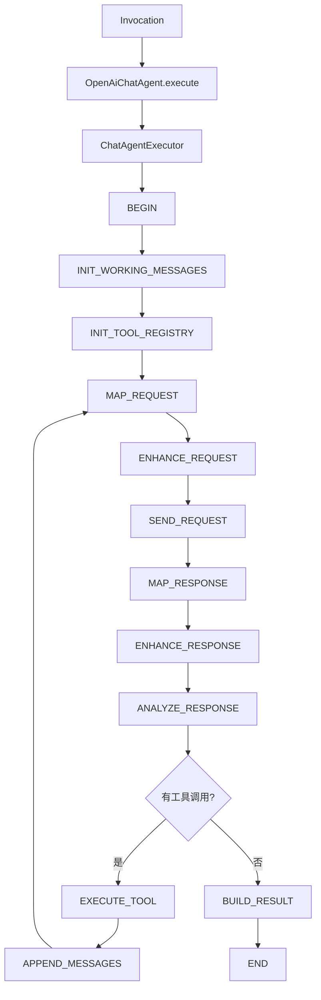
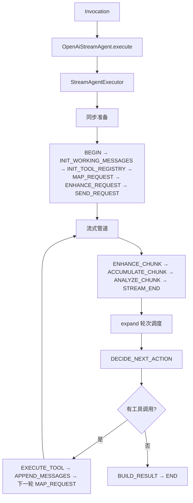
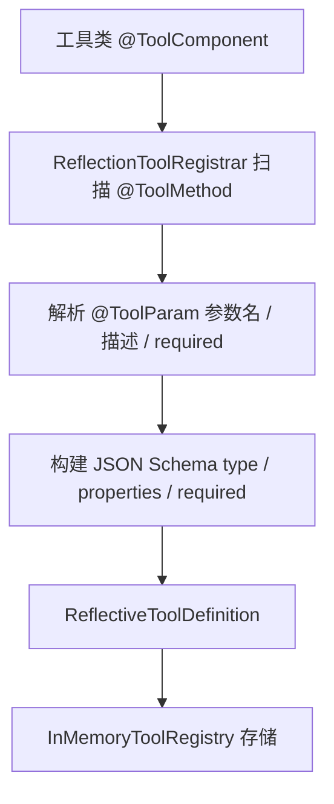
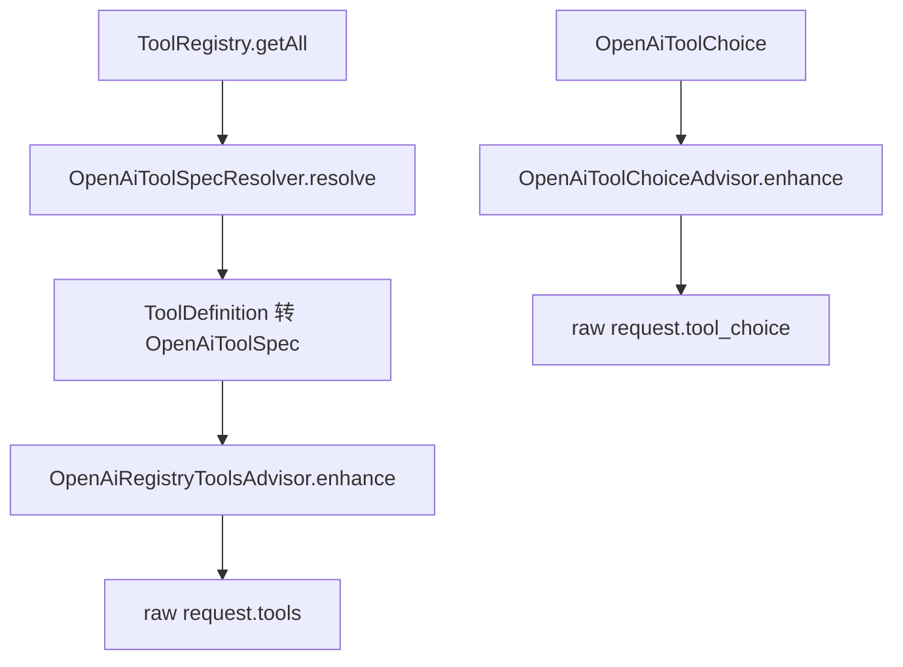
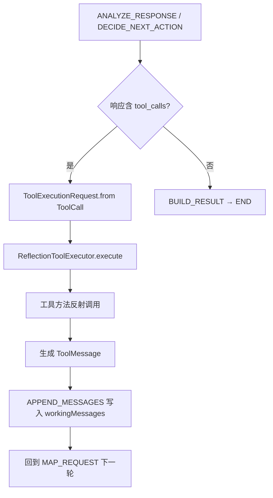

# OpenAI-compatible Chat

本文说明 `liteagent-provider-openai` 与 `liteagent-provider-openai-agent` 当前支持的调用方式，以及工具注册与自动执行链路如何接入请求。

## 0. provider 主线流程


说明：

- 这是当前 `liteagent-provider-openai` 的主调用链
- 普通与流式共享 request mapper 与 advisor 增强阶段
- 主要差异在 transport 与 response mapper

## 1. chatAgent 编排主线（同步，含工具回环）



说明：

- `INIT_WORKING_MESSAGES` 把 `ChatRequest` 中的消息复制到 `workingMessages`，后续多轮基于此维护
- `INIT_TOOL_REGISTRY` 从 request advisor 中提取 `ToolRegistry`，存入 context
- `ANALYZE_RESPONSE` 检查响应中是否有 `tool_calls`，有则路由到 `EXECUTE_TOOL`
- `EXECUTE_TOOL` 通过 `ReflectionToolExecutor` 执行工具，生成 assistant + tool 消息
- `APPEND_MESSAGES` 把暂存的消息写入 `workingMessages`，然后回到 `MAP_REQUEST` 进入下一轮
- 当响应中没有工具调用时，直接进入 `BUILD_RESULT` 结束
- `maxIterations`（默认 10）防止无限工具回环

## 2. streamAgent 编排主线（流式，含工具回环）



说明：

- 流式编排使用三阶段设计：同步准备 → Flux 管道构建 → `expand` 轮次调度
- `ACCUMULATE_CHUNK` 使用 `OpenAiStreamRoundAccumulator` 按 choice.index 和 toolCall.index 合并 delta 片段
- `ANALYZE_CHUNK` 检测 `finishReason` 来标记单轮完成，构建 `finalResponse`
- `DECIDE_NEXT_ACTION` 检查 `finalResponse` 中是否有 `tool_calls`，有则路由到 `EXECUTE_TOOL`
- `EXECUTE_TOOL` 执行工具后，通过 `APPEND_MESSAGES` 把结果写入 `workingMessages`，回到 `MAP_REQUEST` 进入下一轮
- `maxIterations`（默认 10）防止无限工具回环

## 3. 普通 provider 调用

```java
import io.github.halcyonsong.liteagent.core.message.type.constructor.Messages;
import io.github.halcyonsong.liteagent.core.model.request.impl.ChatRequest;
import io.github.halcyonsong.liteagent.provider.openai.client.OpenAiChatClient;
import io.github.halcyonsong.liteagent.provider.openai.request.config.OpenAiBaseRequest;
import io.github.halcyonsong.liteagent.provider.openai.request.config.OpenAiChatCompletionRequest;
import io.github.halcyonsong.liteagent.provider.openai.request.config.OpenAiCompletionOptions;
import io.github.halcyonsong.liteagent.provider.openai.response.config.chat.OpenAiChatCompletionResponse;

public class ProviderRequestExample {

    public OpenAiChatCompletionResponse execute(OpenAiChatClient chatClient) {
        ChatRequest chatRequest = ChatRequest.builder()
                .addMessage(Messages.system("You are a helpful assistant."))
                .addMessage(Messages.user("你好，请介绍一下你自己。"))
                .build();

        OpenAiCompletionOptions completionOptions = OpenAiCompletionOptions.builder()
                .temperature(0.7)
                .maxTokens(256)
                .topP(0.9)
                .n(1)
                .build();

        OpenAiChatCompletionRequest request = OpenAiChatCompletionRequest.builder()
                .baseRequest(OpenAiBaseRequest.builder()
                        .baseUrl("https://api.siliconflow.cn")
                        .apiKey("your-api-key")
                        .model("deepseek-ai/DeepSeek-R1-0528-Qwen3-8B")
                        .build())
                .chatRequest(chatRequest)
                .completionOptions(completionOptions)
                .build();

        return chatClient.chatCompletion(request);
    }
}
```

## 4. chatAgent 编排调用（同步）

```java
import io.github.halcyonsong.liteagent.provider.openai.agent.chat.OpenAiChatAgent;
import io.github.halcyonsong.liteagent.provider.openai.agent.chat.factory.OpenAiChatAgents;
import io.github.halcyonsong.liteagent.provider.openai.runtime.config.HttpRuntimeConfig;
import io.github.halcyonsong.liteagent.provider.openai.response.config.chat.OpenAiChatCompletionResponse;

public class ChatAgentExample {

    public OpenAiChatCompletionResponse execute(OpenAiChatCompletionRequest request) {
        OpenAiChatAgent chatAgent = OpenAiChatAgents.create(
                HttpRuntimeConfig.builder()
                        .maxInMemorySize(16 * 1024 * 1024)
                        .connectTimeoutMillis(5000)
                        .responseTimeoutMillis(60000L)
                        .build()
        );

        return chatAgent.execute(request);
    }
}
```

## 5. streamAgent 编排调用（流式）

```java
import io.github.halcyonsong.liteagent.provider.openai.agent.stream.OpenAiStreamAgent;
import io.github.halcyonsong.liteagent.provider.openai.agent.stream.factory.OpenAiStreamAgents;
import io.github.halcyonsong.liteagent.provider.openai.runtime.config.HttpRuntimeConfig;
import io.github.halcyonsong.liteagent.provider.openai.response.config.stream.OpenAiStreamCompletionResponse;
import reactor.core.publisher.Flux;

public class StreamAgentExample {

    public Flux<OpenAiStreamCompletionResponse> execute(OpenAiChatCompletionRequest request) {
        OpenAiStreamAgent streamAgent = OpenAiStreamAgents.create(
                HttpRuntimeConfig.builder()
                        .maxInMemorySize(16 * 1024 * 1024)
                        .connectTimeoutMillis(5000)
                        .streamResponseTimeoutMillis(null)
                        .build()
        );

        return streamAgent.execute(request);
    }
}
```

## 6. 流式 provider 调用

```java
import io.github.halcyonsong.liteagent.provider.openai.client.OpenAiStreamClient;
import io.github.halcyonsong.liteagent.provider.openai.response.config.stream.OpenAiStreamCompletionResponse;
import reactor.core.publisher.Flux;

public class ProviderStreamExample {

    public Flux<OpenAiStreamCompletionResponse> execute(OpenAiStreamClient streamClient,
                                                        OpenAiChatCompletionRequest request) {
        return streamClient.streamCompletion(request);
    }
}
```

## 7. 工具注册与执行链路

工具链路分为"注册 → 请求增强 → 自动执行"三个阶段。

### 工具注册阶段



### 请求增强阶段



### 工具执行阶段



说明：

- `InMemoryToolRegistry` 只是注册容器，不直接参与请求发送
- `OpenAiToolSpecResolver` 负责将 core 层 `ToolDefinition` 转换为 provider 层 `OpenAiToolSpec`
- `OpenAiRegistryToolsAdvisor` 是把工具注入到请求里的地方，同时作为 agent 提取 `ToolRegistry` 的载体
- `OpenAiToolChoiceAdvisor` 负责补充 `tool_choice`
- agent 的 `INIT_TOOL_REGISTRY` 步骤通过 `ToolRegistrySupport.resolveToolRegistry(invocation)` 从 advisor 中提取 registry
- `ReflectionToolExecutor` 负责反射调用工具方法并生成 `ToolMessage`
- 工具执行后通过 `APPEND_MESSAGES` 把 assistant 消息和 tool 消息写入 `workingMessages`，回到 `MAP_REQUEST` 进入下一轮

## 8. 工具定义示例

```java
import io.github.halcyonsong.liteagent.core.tool.annotation.ToolComponent;
import io.github.halcyonsong.liteagent.core.tool.annotation.ToolMethod;
import io.github.halcyonsong.liteagent.core.tool.annotation.ToolParam;

@ToolComponent
public class WeatherTools {

    @ToolMethod(name = "get_weather", description = "获取指定城市的当前天气信息")
    public String getWeather(
            @ToolParam(description = "城市名称，例如：北京") String city
    ) {
        return city + "：晴，气温 28°C，湿度 45%";
    }

    @ToolMethod(name = "get_time", description = "获取当前时间")
    public String getTime() {
        return java.time.LocalDateTime.now().toString();
    }
}
```

工具注册方式：

```java
// 单个工具类
ToolRegistry registry = ToolRegistries.inMemory(new WeatherTools());

// 多个工具类
ToolRegistry registry = ToolRegistries.inMemory(new WeatherTools(), new TimeTools());

// 从列表注册
ToolRegistry registry = ToolRegistries.inMemory(List.of(new WeatherTools(), new TimeTools()));
```

## 9. 示例配置

建议把主配置当模板，把真实密钥放到副配置里。

```yaml
spring:
  config:
    import: optional:classpath:application-local.yaml

liteagent:
  openai:
    enabled: true
    base-url: ${LITEAGENT_OPENAI_BASE_URL:}
    api-key: ${LITEAGENT_OPENAI_API_KEY:}
    model: ${LITEAGENT_OPENAI_MODEL:}
    runtime:
      max-in-memory-size: 16777216
      connect-timeout-millis: 5000
      response-timeout-millis: 60000
      stream-response-timeout-millis: 300000
```

## 10. 当前范围

目前已经实现的部分：

- 普通 provider chat
- 流式 provider chat
- provider 扩展字段保留
- 工具注册和请求增强
- 工具自动执行闭环（同步 + 流式）
- 多轮 agent 编排（含 `maxIterations` 保护）
- 流式 chunk delta 合并（`OpenAiStreamRoundAccumulator`）
- 响应增强器（request advisor / response advisor）

还没有完成的部分：

- Spring 自动装配增强
- 更多 provider 适配
- 更完善的异常细分与重试策略
