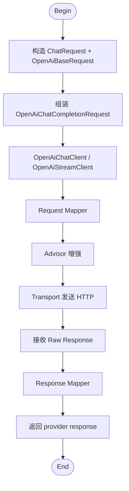
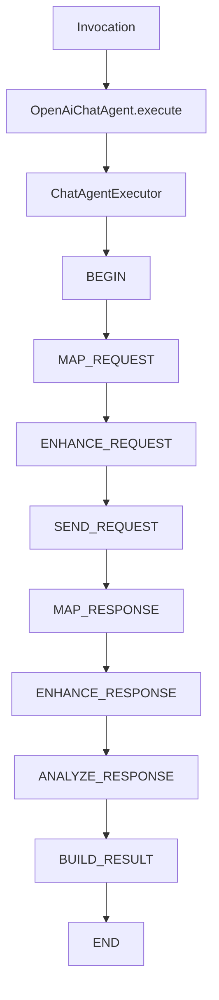
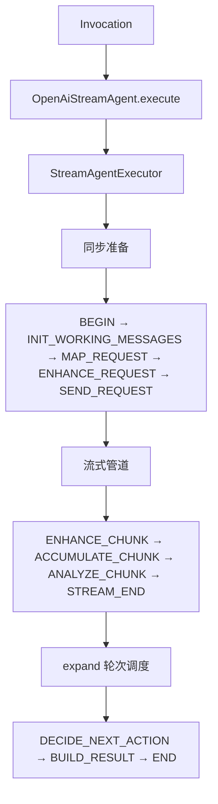
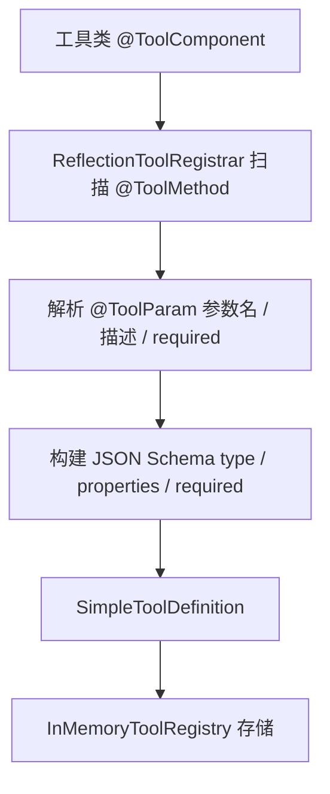
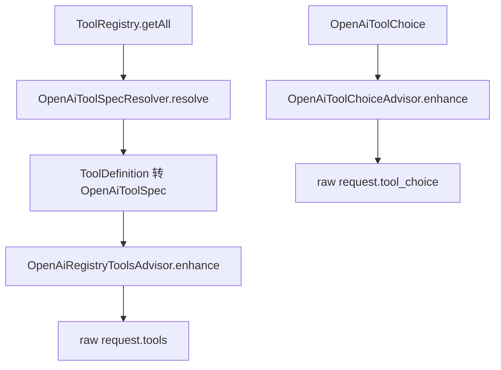

# OpenAI-compatible Chat

本文说明 `liteagent-provider-openai` 与 `liteagent-provider-openai-agent` 当前已经支持的调用方式，以及工具注册链路如何接入请求。

## 0. provider 主线流程



说明：

- 这是当前 `liteagent-provider-openai` 的主调用链
- 普通与流式共享 request mapper 与 advisor 增强阶段
- 主要差异在 transport 与 response mapper

## 1. chatAgent 编排主线（同步）



说明：

- 当前 `liteagent-provider-openai-agent` 支持同步 chat 编排
- `ANALYZE_RESPONSE` 之后还没有接入 `EXECUTE_TOOL`
- 后续工具回环会从 `ANALYZE_RESPONSE` 分叉到 `EXECUTE_TOOL -> MAP_REQUEST`

## 2. streamAgent 编排主线（流式）



说明：

- 流式编排使用三阶段设计：同步准备 → Flux 管道构建 → expand 轮次调度
- 当前 `DECIDE_NEXT_ACTION` 恒返回 `BUILD_RESULT`，即单轮结束
- 后续工具回环会从 `DECIDE_NEXT_ACTION` 分叉到 `EXECUTE_TOOL`，再进入下一轮 `MAP_REQUEST`

## 3. 普通 provider 调用

```java
import io.github.halcyonsong.liteagent.core.message.type.constructor.Messages;
import io.github.halcyonsong.liteagent.core.model.request.impl.ChatRequest;
import io.github.halcyonsong.liteagent.provider.openai.client.OpenAiChatClient;
import io.github.halcyonsong.liteagent.provider.openai.request.config.OpenAiBaseRequest;
import io.github.halcyonsong.liteagent.provider.openai.request.config.OpenAiChatCompletionRequest;
import io.github.halcyonsong.liteagent.provider.openai.request.config.OpenAiCompletionOptions;
import io.github.halcyonsong.liteagent.provider.openai.response.config.chat.OpenAiChatCompletionResponse;

public class ProviderRequestExample {

    public OpenAiChatCompletionResponse execute(OpenAiChatClient chatClient) {
        ChatRequest chatRequest = ChatRequest.builder()
                .addMessage(Messages.system("You are a helpful assistant."))
                .addMessage(Messages.user("你好，请介绍一下你自己。"))
                .build();

        OpenAiCompletionOptions completionOptions = OpenAiCompletionOptions.builder()
                .temperature(0.7)
                .maxTokens(256)
                .topP(0.9)
                .n(1)
                .build();

        OpenAiChatCompletionRequest request = OpenAiChatCompletionRequest.builder()
                .baseRequest(OpenAiBaseRequest.builder()
                        .baseUrl("https://api.siliconflow.cn")
                        .apiKey("your-api-key")
                        .model("deepseek-ai/DeepSeek-R1-0528-Qwen3-8B")
                        .build())
                .chatRequest(chatRequest)
                .completionOptions(completionOptions)
                .build();

        return chatClient.chatCompletion(request);
    }
}
```

## 4. chatAgent 编排调用（同步）

```java
import io.github.halcyonsong.liteagent.provider.openai.agent.chat.OpenAiChatAgent;
import io.github.halcyonsong.liteagent.provider.openai.agent.chat.factory.OpenAiChatAgents;
import io.github.halcyonsong.liteagent.provider.openai.runtime.config.HttpRuntimeConfig;
import io.github.halcyonsong.liteagent.provider.openai.response.config.chat.OpenAiChatCompletionResponse;

public class ChatAgentExample {

    public OpenAiChatCompletionResponse execute(OpenAiChatCompletionRequest request) {
        OpenAiChatAgent chatAgent = OpenAiChatAgents.create(
                HttpRuntimeConfig.builder()
                        .maxInMemorySize(16 * 1024 * 1024)
                        .connectTimeoutMillis(5000)
                        .responseTimeoutMillis(60000L)
                        .build()
        );

        return chatAgent.execute(request);
    }
}
```

## 5. streamAgent 编排调用（流式）

```java
import io.github.halcyonsong.liteagent.provider.openai.agent.stream.OpenAiStreamAgent;
import io.github.halcyonsong.liteagent.provider.openai.agent.stream.factory.OpenAiStreamAgents;
import io.github.halcyonsong.liteagent.provider.openai.runtime.config.HttpRuntimeConfig;
import io.github.halcyonsong.liteagent.provider.openai.response.config.stream.OpenAiStreamCompletionResponse;
import reactor.core.publisher.Flux;

public class StreamAgentExample {

    public Flux<OpenAiStreamCompletionResponse> execute(OpenAiChatCompletionRequest request) {
        OpenAiStreamAgent streamAgent = OpenAiStreamAgents.create(
                HttpRuntimeConfig.builder()
                        .maxInMemorySize(16 * 1024 * 1024)
                        .connectTimeoutMillis(5000)
                        .streamResponseTimeoutMillis(null)
                        .build()
        );

        return streamAgent.execute(request);
    }
}
```

## 6. 流式 provider 调用

```java
import io.github.halcyonsong.liteagent.provider.openai.client.OpenAiStreamClient;
import io.github.halcyonsong.liteagent.provider.openai.response.config.stream.OpenAiStreamCompletionResponse;
import reactor.core.publisher.Flux;

public class ProviderStreamExample {

    public Flux<OpenAiStreamCompletionResponse> execute(OpenAiStreamClient streamClient,
                                                        OpenAiChatCompletionRequest request) {
        return streamClient.streamCompletion(request);
    }
}
```

## 7. tools 注入链路

当前工具链路是"注册后增强请求"，不是"直接把方法塞进 client"。

### 工具注册阶段



### 请求增强阶段



说明：

- `InMemoryToolRegistry` 只是注册容器，不直接参与请求发送
- `OpenAiToolSpecResolver` 负责将 core 层 `ToolDefinition` 转换为 provider 层 `OpenAiToolSpec`
- `OpenAiRegistryToolsAdvisor` 才是真正把工具注入到请求里的地方
- `OpenAiToolChoiceAdvisor` 负责补充 `tool_choice`
- 当前还没有自动执行工具后的下一轮请求闭环

## 8. 示例配置

建议把主配置当模板，把真实密钥放到副配置里。

```yaml
spring:
  config:
    import: optional:classpath:application-local.yaml

liteagent:
  openai:
    enabled: true
    base-url: ${LITEAGENT_OPENAI_BASE_URL:}
    api-key: ${LITEAGENT_OPENAI_API_KEY:}
    model: ${LITEAGENT_OPENAI_MODEL:}
    runtime:
      max-in-memory-size: 16777216
      connect-timeout-millis: 5000
      response-timeout-millis: 60000
      stream-response-timeout-millis: 300000
```

## 9. 当前限制

目前已经实现的部分：

- 普通 provider chat
- 流式 provider chat
- provider 扩展字段保留
- 工具注册和请求增强
- OpenAI 同步 chatAgent 编排
- OpenAI 流式 streamAgent 编排（最小单轮链路）

还没有完成的部分：

- 工具执行闭环
- 多轮 agent 编排
- 响应增强器
- 流式 chunk delta 合并
