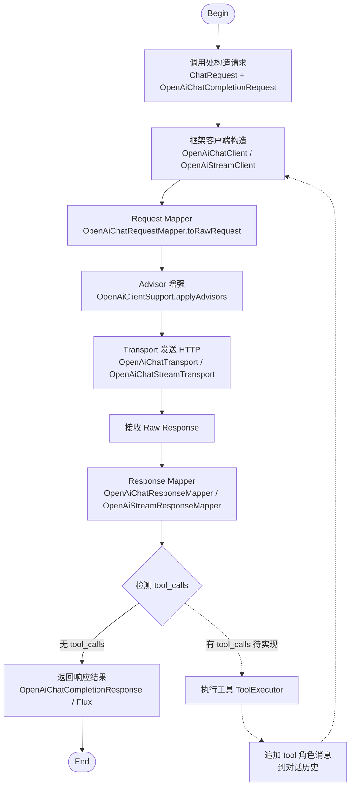
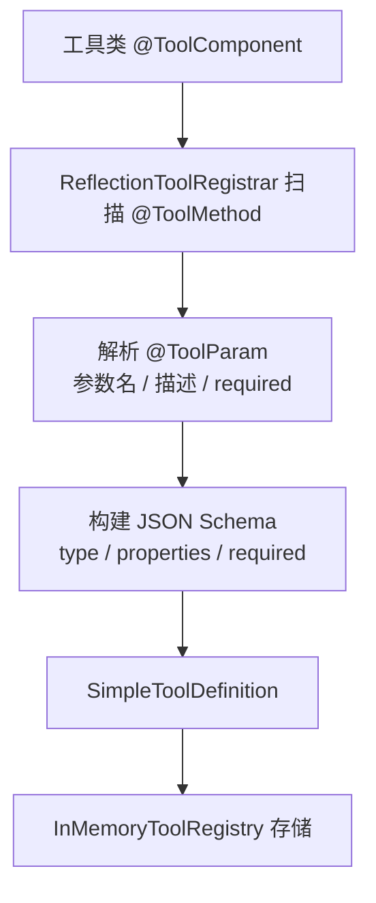
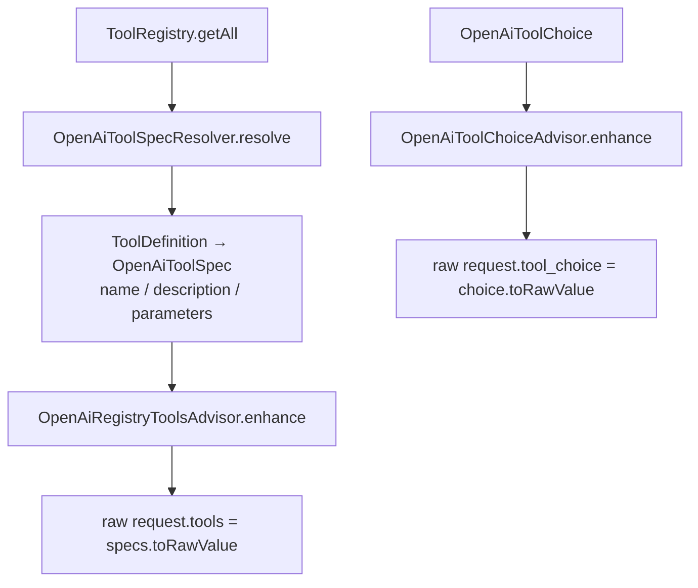

# OpenAI-compatible Chat

本文说明 `liteagent-provider-openai` 当前已经支持的调用方式，以及工具注册链路如何接入请求。

## 0. 完整调用流程



说明：

- 实线部分为当前已实现的完整链路
- 虚线部分为工具执行闭环，尚未实现
- 普通调用和流式调用共享 Advisor 增强环节，仅 transport 和响应类型不同

## 1. 普通调用

这是最常规的调用方式。

```java
import io.github.halcyonsong.liteagent.core.message.type.constructor.Messages;
import io.github.halcyonsong.liteagent.core.model.request.ChatInvocation;
import io.github.halcyonsong.liteagent.core.model.request.ChatOptions;
import io.github.halcyonsong.liteagent.core.model.request.ChatRequest;
import io.github.halcyonsong.liteagent.core.model.response.chat.ChatResult;
import io.github.halcyonsong.liteagent.provider.openai.client.OpenAiChatClient;
import io.github.halcyonsong.liteagent.provider.openai.request.config.OpenAiBaseRequest;

public class UnifiedChatExample {

    public ChatResult execute(OpenAiChatClient chatClient) {
        ChatRequest chatRequest = ChatRequest.builder()
                .addMessage(Messages.system("You are a helpful assistant."))
                .addMessage(Messages.user("你好，请介绍一下你自己。"))
                .build();

        ChatOptions chatOptions = ChatOptions.builder()
                .temperature(0.7)
                .maxTokens(256)
                .build();

        ChatInvocation invocation = ChatInvocation.builder()
                .baseRequest(OpenAiBaseRequest.builder()
                        .baseUrl("https://api.siliconflow.cn")
                        .apiKey("your-api-key")
                        .model("deepseek-ai/DeepSeek-R1-0528-Qwen3-8B")
                        .build())
                .chatRequest(chatRequest)
                .chatOptions(chatOptions)
                .build();

        return chatClient.chat(invocation);
    }
}
```

## 2. 流式调用

流式调用与普通调用分离，不共用同一个返回语义。

```java
import io.github.halcyonsong.liteagent.core.model.request.ChatInvocation;
import io.github.halcyonsong.liteagent.provider.openai.client.OpenAiStreamClient;

public class UnifiedStreamExample {

    public void execute(OpenAiStreamClient streamClient, ChatInvocation invocation) {
        streamClient.stream(invocation)
                .doOnNext(chunk -> chunk.getChoices().forEach(choice -> {
                    if (choice.getDelta() != null) {
                        System.out.println("role = " + choice.getDelta().getRole());
                        System.out.println("content = " + choice.getDelta().getContent());
                        System.out.println("reasoning = " + choice.getDelta().getReasoningContent());
                    }
                }))
                .blockLast();
    }
}
```

## 3. provider 请求对象

如果需要传入 provider 扩展参数，可以直接使用 provider 请求对象。

```java
import io.github.halcyonsong.liteagent.core.message.type.constructor.Messages;
import io.github.halcyonsong.liteagent.core.model.request.ChatRequest;
import io.github.halcyonsong.liteagent.provider.openai.client.OpenAiChatClient;
import io.github.halcyonsong.liteagent.provider.openai.request.config.OpenAiBaseRequest;
import io.github.halcyonsong.liteagent.provider.openai.request.config.OpenAiChatCompletionRequest;
import io.github.halcyonsong.liteagent.provider.openai.request.config.OpenAiCompletionOptions;
import io.github.halcyonsong.liteagent.provider.openai.response.config.chat.OpenAiChatCompletionResponse;

public class ProviderRequestExample {

    public OpenAiChatCompletionResponse execute(OpenAiChatClient chatClient) {
        ChatRequest chatRequest = ChatRequest.builder()
                .addMessage(Messages.system("You are a helpful assistant."))
                .addMessage(Messages.user("你好，请介绍一下你自己。"))
                .build();

        OpenAiCompletionOptions completionOptions = OpenAiCompletionOptions.builder()
                .temperature(0.7)
                .maxTokens(256)
                .topP(0.9)
                .n(1)
                .build();

        OpenAiChatCompletionRequest request = OpenAiChatCompletionRequest.builder()
                .baseRequest(OpenAiBaseRequest.builder()
                        .baseUrl("https://api.siliconflow.cn")
                        .apiKey("your-api-key")
                        .model("deepseek-ai/DeepSeek-R1-0528-Qwen3-8B")
                        .build())
                .chatRequest(chatRequest)
                .completionOptions(completionOptions)
                .build();

        return chatClient.chat(request);
    }
}
```

## 4. QuickRequest

适合快速测试。

```java
import io.github.halcyonsong.liteagent.provider.openai.client.OpenAiChatClient;
import io.github.halcyonsong.liteagent.provider.openai.request.quickrequest.OpenAiQuickChatRequest;
import io.github.halcyonsong.liteagent.provider.openai.response.config.chat.OpenAiChatCompletionResponse;

public class QuickRequestExample {

    public OpenAiChatCompletionResponse execute(OpenAiChatClient chatClient) {
        OpenAiQuickChatRequest request = OpenAiQuickChatRequest.builder()
                .baseUrl("https://api.siliconflow.cn")
                .apiKey("your-api-key")
                .model("deepseek-ai/DeepSeek-R1-0528-Qwen3-8B")
                .systemMessage("You are a helpful assistant.")
                .userMessage("你好，请介绍一下你自己。")
                .build();

        return chatClient.chatCompletion(request);
    }
}
```

## 5. tools 注入链路

当前工具链路是"注册后增强请求"，不是"直接把方法塞进 client"。

### 工具注册阶段



### 请求增强阶段



说明：

- `InMemoryToolRegistry` 只是注册容器，不直接参与请求
- `OpenAiToolSpecResolver` 负责将 core 层 `ToolDefinition` 转换为 provider 层 `OpenAiToolSpec`
- `OpenAiRegistryToolsAdvisor` 才是真正把工具注入到请求里的地方
- `OpenAiToolChoiceAdvisor` 负责补充 `tool_choice`
- 目前还没有自动执行工具后的下一轮请求闭环

## 6. tool_choice 说明

`tool_choice` 与 `tools` 是同级字段。

它支持这些常见形式：

- `none`
- 指定 function name
- 不设置时由模型自行决定

如果强制指定了不存在的工具名，provider 会报错。

## 7. 当前限制

目前已经实现的部分：

- 普通 chat
- 流式 chat
- provider 扩展字段保留
- 工具注册和请求增强

还没有完成的部分：

- 工具执行闭环
- 多轮 agent 编排
- Spring 自动装配增强

## 8. 示例配置

建议把主配置当模板，把真实密钥放到副配置里。

```yaml
spring:
  config:
    import: optional:classpath:application-local.yaml

liteagent:
  openai:
    enabled: true
    base-url: ${LITEAGENT_OPENAI_BASE_URL:}
    api-key: ${LITEAGENT_OPENAI_API_KEY:}
    model: ${LITEAGENT_OPENAI_MODEL:}
    runtime:
      max-in-memory-size: 16777216
      connect-timeout-millis: 5000
      response-timeout-millis: 60000
      stream-response-timeout-millis: 300000
```

`stream-response-timeout-millis` 建议填写真实数值，不要写字符串 `null`。
