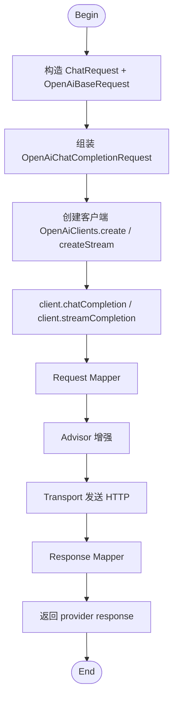
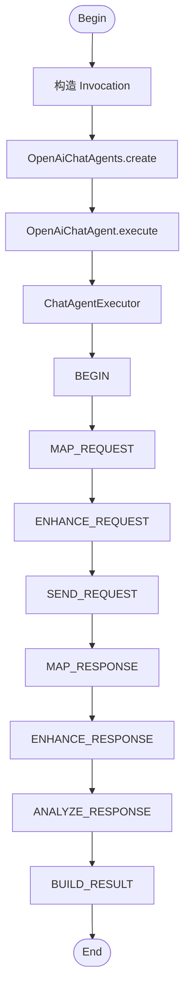
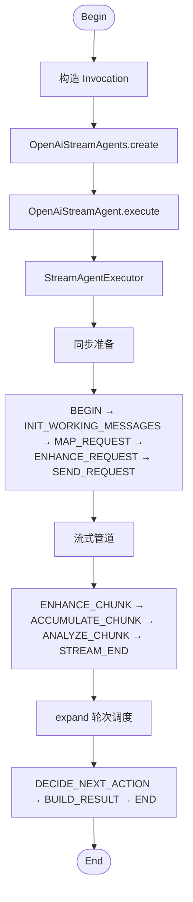

# Quick Start

本文档给出 `liteagent-template` 当前第一版的最短接入方式。

当前 Quick Start 面向：

- OpenAI-compatible 协议供应商
- Java 17
- provider 直调
- chatAgent 同步编排入口
- streamAgent 流式编排入口

## 0. 调用流程概览

### provider 直调



### chatAgent 编排（同步）



### streamAgent 编排（流式）



## 1. 引入依赖

### provider 直调

```xml
<dependencies>
    <dependency>
        <groupId>io.github.halcyonsong</groupId>
        <artifactId>liteagent-core</artifactId>
        <version>0.3.0-SNAPSHOT</version>
    </dependency>

    <dependency>
        <groupId>io.github.halcyonsong</groupId>
        <artifactId>liteagent-provider-openai</artifactId>
        <version>0.3.0-SNAPSHOT</version>
    </dependency>
</dependencies>
```

### chatAgent 编排（同步）

```xml
<dependencies>
    <dependency>
        <groupId>io.github.halcyonsong</groupId>
        <artifactId>liteagent-core</artifactId>
        <version>0.3.0-SNAPSHOT</version>
    </dependency>

    <dependency>
        <groupId>io.github.halcyonsong</groupId>
        <artifactId>liteagent-agent</artifactId>
        <version>0.3.0-SNAPSHOT</version>
    </dependency>

    <dependency>
        <groupId>io.github.halcyonsong</groupId>
        <artifactId>liteagent-provider-openai</artifactId>
        <version>0.3.0-SNAPSHOT</version>
    </dependency>

    <dependency>
        <groupId>io.github.halcyonsong</groupId>
        <artifactId>liteagent-provider-openai-agent</artifactId>
        <version>0.3.0-SNAPSHOT</version>
    </dependency>
</dependencies>
```

### streamAgent 编排（流式）

依赖与 chatAgent 编排相同，`liteagent-provider-openai-agent` 已包含同步和流式两套实现。

## 2. 创建 provider 客户端

### 普通对话客户端

```java
import io.github.halcyonsong.liteagent.provider.openai.client.OpenAiChatClient;
import io.github.halcyonsong.liteagent.provider.openai.client.factory.OpenAiClients;

public class ChatClientExample {

    public OpenAiChatClient createChatClient() {
        return OpenAiClients.create(
                16 * 1024 * 1024,
                5000,
                60000L
        );
    }
}
```

### 流式对话客户端

```java
import io.github.halcyonsong.liteagent.provider.openai.client.OpenAiStreamClient;
import io.github.halcyonsong.liteagent.provider.openai.client.factory.OpenAiClients;

public class StreamClientExample {

    public OpenAiStreamClient createStreamClient() {
        return OpenAiClients.createStream(
                16 * 1024 * 1024,
                5000,
                null
        );
    }
}
```

说明：

- 普通客户端第三个参数是 `responseTimeoutMillis`
- 流式客户端第三个参数是 `streamResponseTimeoutMillis`
- 流式超时传 `null` 表示不设置流式总响应超时

## 3. 构造 provider 请求

```java
import io.github.halcyonsong.liteagent.core.message.type.constructor.Messages;
import io.github.halcyonsong.liteagent.core.model.request.impl.ChatRequest;
import io.github.halcyonsong.liteagent.provider.openai.request.config.OpenAiBaseRequest;
import io.github.halcyonsong.liteagent.provider.openai.request.config.OpenAiChatCompletionRequest;
import io.github.halcyonsong.liteagent.provider.openai.request.config.OpenAiCompletionOptions;

public class RequestExample {

    public OpenAiChatCompletionRequest buildRequest() {
        OpenAiBaseRequest baseRequest = OpenAiBaseRequest.builder()
                .baseUrl("https://api.siliconflow.cn")
                .apiKey("your-api-key")
                .model("deepseek-ai/DeepSeek-R1-0528-Qwen3-8B")
                .build();

        ChatRequest chatRequest = ChatRequest.builder()
                .addMessage(Messages.system("You are a helpful assistant."))
                .addMessage(Messages.user("你好，请用一句话介绍你自己。"))
                .build();

        return OpenAiChatCompletionRequest.builder()
                .baseRequest(baseRequest)
                .chatRequest(chatRequest)
                .completionOptions(OpenAiCompletionOptions.builder()
                        .temperature(0.7)
                        .maxTokens(256)
                        .build())
                .build();
    }
}
```

说明：

- `baseUrl` 只提供基础地址即可，例如：
  - `https://api.siliconflow.cn`
  - `https://api.siliconflow.cn/v1`
  - `https://api.siliconflow.cn/v1/chat/completions`
- 框架会自动规范化到 `/v1/chat/completions`

## 4. 发起普通 provider 调用

```java
import io.github.halcyonsong.liteagent.core.message.Message;
import io.github.halcyonsong.liteagent.core.model.response.chat.ChatChoice;
import io.github.halcyonsong.liteagent.provider.openai.client.OpenAiChatClient;
import io.github.halcyonsong.liteagent.provider.openai.response.config.chat.OpenAiChatCompletionResponse;

public class ChatCallExample {

    public void printChatResult(OpenAiChatClient chatClient, OpenAiChatCompletionRequest request) {
        OpenAiChatCompletionResponse response = chatClient.chatCompletion(request);

        System.out.println("response id = " + response.getBaseResponse().getId());
        System.out.println("model = " + response.getBaseResponse().getModel());

        for (ChatChoice choice : response.getChoices()) {
            System.out.println("choice index = " + choice.getIndex());
            System.out.println("finish reason = " + choice.getFinishReason());

            for (Message message : choice.getChatResponse().getMessages()) {
                System.out.println("message content = " + message.getContent());

                if (message instanceof OpenAiAssistantMessage assistantMessage) {
                    System.out.println("reasoning = " + assistantMessage.getReasoningContent());
                }
            }
        }
    }
}
```

## 5. 发起流式 provider 调用

```java
import io.github.halcyonsong.liteagent.provider.openai.client.OpenAiStreamClient;

public class StreamCallExample {

    public void printStreamResult(OpenAiStreamClient streamClient, OpenAiChatCompletionRequest request) {
        streamClient.streamCompletion(request)
                .doOnNext(response -> response.getChoices().forEach(choice -> {
                    if (choice.getDelta() != null) {
                        System.out.println("delta role = " + choice.getDelta().getRole());
                        System.out.println("delta content = " + choice.getDelta().getContent());
                        System.out.println("delta reasoning = " + choice.getDelta().getReasoningContent());
                    }
                }))
                .blockLast();
    }
}
```

## 6. QuickRequest 用法

```java
import io.github.halcyonsong.liteagent.provider.openai.client.OpenAiChatClient;
import io.github.halcyonsong.liteagent.provider.openai.request.quickrequest.OpenAiQuickChatRequest;
import io.github.halcyonsong.liteagent.provider.openai.response.config.chat.OpenAiChatCompletionResponse;

public class QuickRequestExample {

    public OpenAiChatCompletionResponse execute(OpenAiChatClient chatClient) {
        OpenAiQuickChatRequest request = OpenAiQuickChatRequest.builder()
                .baseUrl("https://api.siliconflow.cn")
                .apiKey("your-api-key")
                .model("deepseek-ai/DeepSeek-R1-0528-Qwen3-8B")
                .systemMessage("You are a helpful assistant.")
                .userMessage("你好，请简单介绍一下你自己。")
                .build();

        return chatClient.chatCompletion(request);
    }
}
```

## 7. 最小 chatAgent 编排入口（同步）

```java
import io.github.halcyonsong.liteagent.provider.openai.agent.chat.OpenAiChatAgent;
import io.github.halcyonsong.liteagent.provider.openai.agent.chat.factory.OpenAiChatAgents;
import io.github.halcyonsong.liteagent.provider.openai.runtime.config.HttpRuntimeConfig;
import io.github.halcyonsong.liteagent.provider.openai.response.config.chat.OpenAiChatCompletionResponse;

public class ChatAgentCallExample {

    public OpenAiChatCompletionResponse execute(OpenAiChatCompletionRequest request) {
        OpenAiChatAgent chatAgent = OpenAiChatAgents.create(
                HttpRuntimeConfig.builder()
                        .maxInMemorySize(16 * 1024 * 1024)
                        .connectTimeoutMillis(5000)
                        .responseTimeoutMillis(60000L)
                        .build()
        );

        return chatAgent.execute(request);
    }
}
```

## 8. 最小 streamAgent 编排入口（流式）

```java
import io.github.halcyonsong.liteagent.provider.openai.agent.stream.OpenAiStreamAgent;
import io.github.halcyonsong.liteagent.provider.openai.agent.stream.factory.OpenAiStreamAgents;
import io.github.halcyonsong.liteagent.provider.openai.runtime.config.HttpRuntimeConfig;

public class StreamAgentCallExample {

    public void execute(OpenAiChatCompletionRequest request) {
        OpenAiStreamAgent streamAgent = OpenAiStreamAgents.create(
                HttpRuntimeConfig.builder()
                        .maxInMemorySize(16 * 1024 * 1024)
                        .connectTimeoutMillis(5000)
                        .streamResponseTimeoutMillis(null)
                        .build()
        );

        streamAgent.execute(request)
                .doOnNext(response -> response.getChoices().forEach(choice -> {
                    if (choice.getDelta() != null) {
                        String content = choice.getDelta().getContent();
                        if (content != null) {
                            System.out.print(content);
                        }
                    }
                }))
                .blockLast();
    }
}
```

说明：

- `OpenAiChatAgent` 把单轮同步 provider 能力拆进步骤执行器
- `OpenAiStreamAgent` 把流式 provider 能力拆进步骤执行器，支持 Flux 统一编排
- 当前两个 agent 都还没有工具自动执行回环
- streamAgent 的 `streamResponseTimeoutMillis` 传 `null` 表示不设置超时

## 9. 当前范围

当前已经支持：

- 普通非流式 provider 对话调用
- 流式 provider 对话调用
- OpenAI-compatible provider 扩展响应字段保留
- tools / tool_choice 请求增强
- OpenAI 最小同步 chatAgent 编排入口
- OpenAI 最小流式 streamAgent 编排入口

当前尚未覆盖：

- tools 自动执行闭环
- 多轮 agent 编排
- response enhancer
- stream 聚合后的 delta 合并
