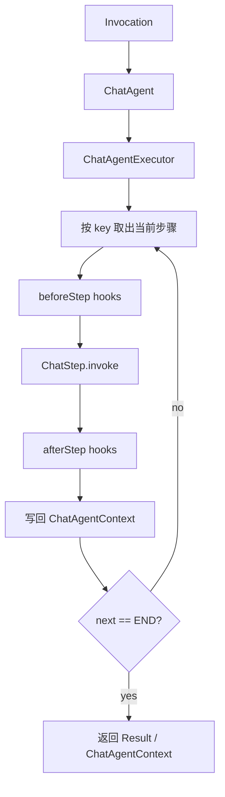
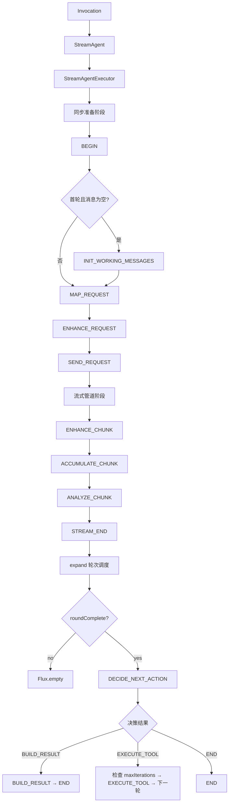

# liteagent-agent

`liteagent-agent` 是框架的通用编排层。
它不关心具体 provider 协议，只负责把一次调用拆成步骤并顺序调度。

## 职责

- 定义 chat（同步）和 stream（流式）两条编排路径
- 定义步骤接口与步骤 key
- 定义单次执行上下文
- 定义步骤 hook
- 定义执行终止原因

## 包结构

```text
io.github.halcyonsong.liteagent.agent
├─ chat                    # 同步编排路径
│  ├─ context
│  ├─ executor
│  ├─ hook
│  └─ step
├─ stream                  # 流式编排路径
│  ├─ context
│  ├─ executor
│  ├─ hook
│  ├─ state
│  └─ step
└─ state                   # 通用状态（终止原因等）
```

## chat 编排主线（同步）



### chat 步骤 key

```text
BEGIN → INIT_WORKING_MESSAGES → INIT_TOOL_REGISTRY → MAP_REQUEST → ENHANCE_REQUEST → SEND_REQUEST → MAP_RESPONSE → ENHANCE_RESPONSE → ANALYZE_RESPONSE → EXECUTE_TOOL → APPEND_MESSAGES → BUILD_RESULT → END
```

其中 `ANALYZE_RESPONSE` 根据响应是否含工具调用决定路由：
- 有工具调用 → `EXECUTE_TOOL` → `APPEND_MESSAGES` → 回到 `MAP_REQUEST`（下一轮）
- 无工具调用 → `BUILD_RESULT` → `END`

## stream 编排主线（流式）



### stream 步骤 key

```text
同步阶段: BEGIN → INIT_WORKING_MESSAGES → INIT_TOOL_REGISTRY → MAP_REQUEST → ENHANCE_REQUEST → SEND_REQUEST
流式阶段: SEND_REQUEST → ENHANCE_CHUNK → ACCUMULATE_CHUNK → ANALYZE_CHUNK → STREAM_END
调度阶段: DECIDE_NEXT_ACTION → EXECUTE_TOOL → APPEND_MESSAGES → BUILD_RESULT / END
```

其中 `DECIDE_NEXT_ACTION` 根据响应是否含工具调用决定路由：
- 有工具调用 → `EXECUTE_TOOL` → `APPEND_MESSAGES` → 回到 `MAP_REQUEST`（下一轮）
- 无工具调用 → `BUILD_RESULT` → `END`

## 已实现内容

### chat 路径

- `ChatAgent` — 门面入口
- `ChatAgentContext` — 请求级上下文
- `ChatAgentExecutor` — key-based 步骤推进执行器
- `ChatStep` / `ChatStepKey` — 步骤接口与 key 接口（内置 13 个常量，支持 `of(String)` 自定义）
- `StepHook` — 步骤钩子（before / after / error）
- `AgentTerminationReason` — 终止原因枚举

### stream 路径

- `StreamAgent<T>` — 门面入口（泛型化）
- `StreamAgentContext<T>` — 请求级上下文（泛型化，含 workingMessages、rounds）
- `StreamAgentExecutor<T>` — 三阶段执行器（同步准备 → Flux 管道 → expand 轮次调度）
- `StreamStep<T>` / `StreamSyncStep` — 流式步骤接口 / 同步步骤接口
- `StreamApplyResult<T>` — 流式步骤返回值（output + nextKey）
- `StreamStepKey` — 步骤 key 接口（内置 15 个常量，支持 `of(String)` 自定义）
- `StreamRoundState` — 单轮状态（roundIndex、roundComplete、accumulator、finalResponse）
- `StreamStepHook` — 步骤钩子（before / after / error）

## ChatAgentContext 设计

`ChatAgentContext` 的生命周期只存在于一次执行内部，主要保存：

- `executionId`：本次执行唯一标识
- `invocation`：本次统一输入
- `attributes`：跨步骤共享扩展数据
- `result`：最终结果
- `iteration` / `maxIterations`：工具回环控制（`maxIterations` 默认 10，由执行器构造器传入，防止无限工具调用循环）
- `terminationReason`：终止原因
- `cancelled`：取消标志（volatile，支持跨线程取消）
- `pendingAssistantMessages` / `pendingToolMessages`：当前轮待追加消息缓存

## StreamAgentContext 设计

`StreamAgentContext<T>` 是流式路径的请求级上下文，额外包含：

- `workingMessages`：跨轮次维护的消息列表
- `rounds`：每轮的 `StreamRoundState` 列表
- `currentRound()`：获取当前轮次状态
- `output`：流式输出 Flux
- `iteration` / `maxIterations`：多轮工具调用控制（`maxIterations` 默认 10，由执行器构造器传入）
- `controlSignal`：内部控制哨兵（volatile，驱动 expand / 轮次切换）
- `cancelled`：取消标志（volatile，支持跨线程取消）

## 设计边界

当前模块不包含：

- provider 请求结构
- HTTP 调用实现
- provider 响应映射

这些内容由上层 provider 模块或 provider-agent 模块负责。
agent 模块定义工具执行步骤 key（`EXECUTE_TOOL`、`APPEND_MESSAGES`、`INIT_TOOL_REGISTRY`），但具体执行逻辑由 provider-agent 模块实现。

## Step Key 可扩展性

`ChatStepKey` 和 `StreamStepKey` 均为接口，内置常量覆盖标准流程，同时通过 `of(String)` 工厂方法支持自定义 key：

- 自定义 key 与内置 key 基于 `name()` 做相等性判断
- 执行器内部使用 `HashMap` 存储步骤，支持任意 key 类型
- 调用方可在构建步骤注册表时插入自定义步骤，实现链路扩展

## END 步骤执行机制

两条链路均在主循环结束后单独执行 END 步骤：

- **chat**：while 循环退出后（`nextKey == END`），在循环外单独执行一次 END 步骤，用于收尾逻辑（日志、清理等）
- **stream**：每轮 `buildNext` 中检测到 `BUILD_RESULT` 或 `END` 时，单独执行 END 步骤

END 步骤的返回值不影响流程，始终在循环外部执行，确保即使主流程异常也能尝试执行收尾逻辑。
