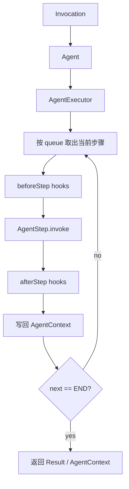

# liteagent-agent

`liteagent-agent` 是框架的通用编排层。
它不关心具体 provider 协议，只负责把一次调用拆成步骤并顺序调度。

## 职责

- 定义 agent 执行入口
- 定义步骤接口与步骤 key
- 定义单次执行上下文
- 定义步骤 hook
- 定义执行终止原因

## 包结构

```text
io.github.halcyonsong.liteagent.agent
├─ context
├─ executor
├─ hook
├─ state
└─ step
```

## 当前主线



## 已实现内容

- `Agent`
- `AgentContext`
- `AgentExecutor`
- `AgentStep`
- `AgentStepKey`
- `StepHook`
- `AgentTerminationReason`

## AgentContext 设计

`AgentContext` 的生命周期只存在于一次执行内部，主要保存：

- `executionId`：本次执行唯一标识
- `invocation`：本次统一输入
- `attributes`：跨步骤共享扩展数据
- `result`：最终结果
- `iteration` / `maxIterations`：后续工具回环控制预留
- `terminationReason`：终止原因

## 设计边界

当前模块不包含：

- provider 请求结构
- HTTP 调用实现
- 工具执行实现
- provider 响应映射

这些内容由上层 provider 模块或 provider-agent 模块负责。
