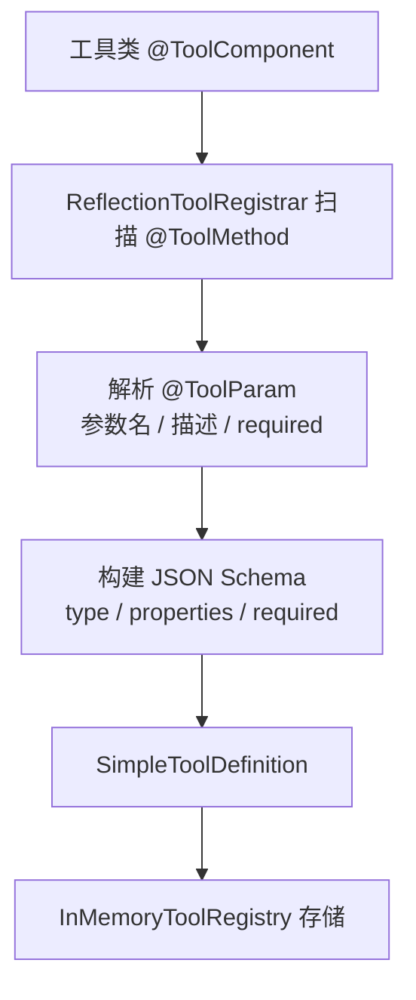
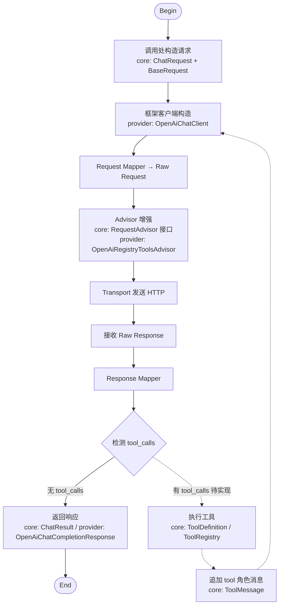

# liteagent-core

`liteagent-core` 是框架的统一抽象层。
这里只保留跨供应商稳定的基础模型，不放 OpenAI-compatible 这类协议私有字段。

## 职责

- 定义统一消息模型
- 定义统一请求模型
- 定义统一普通响应模型
- 定义统一流式响应模型
- 定义工具注册规范
- 定义框架基础异常

## 包结构

```text
io.github.halcyonsong.liteagent.core
├─ exception
├─ message
├─ model
│  ├─ request
│  └─ response
│     ├─ chat
│     └─ stream
└─ tool
   ├─ annotation
   ├─ impl
   └─ norm
```

## 已实现内容

### message

统一消息抽象：

- `Message`
- `AbstractMessage`
- `UserMessage`
- `AssistantMessage`
- `SystemMessage`
- `ToolMessage`
- `Messages`

### request

统一请求模型：

- `BaseRequest`
- `ChatRequest`
- `ChatOptions`
- `ChatInvocation`

### response.chat

统一普通响应模型：

- `BaseResponse`
- `ChatResponse`
- `ChatChoice`
- `ChatResult`
- `Usage`

### response.stream

统一流式响应模型：

- `StreamDelta`
- `StreamChoice`
- `StreamChunk`

### tool

工具注册规范：

- `@ToolComponent`
- `@ToolMethod`
- `@ToolParam`
- `ToolDefinition`
- `ToolRegistry`
- `ToolRegistrar`
- `InMemoryToolRegistry`
- `ReflectionToolRegistrar`
- `ToolRegistries`

### exception

基础异常：

- `LiteAgentException`
- `ModelException`
- `ToolExecutionException`

## 设计边界

core 不直接包含这些内容：

- OpenAI-compatible `reasoning_content`
- OpenAI-compatible `tool_calls`
- provider 扩展 `usage`
- 具体 HTTP 实现
- 具体工具执行编排

这些内容留在 provider 或更上层的编排层。

## 工具注册链路

### 注册阶段



### 完整调用流程中 core 的位置



说明：

- `core` 标注的节点为 core 模块定义的抽象，provider 层依赖这些抽象
- `provider` 标注的节点为 OpenAI-compatible 协议的具体实现
- core 层只定义规范（`ToolDefinition`、`ToolRegistry`、`RequestAdvisor`），不参与具体协议交互
- 工具执行闭环（虚线部分）将由上层编排层实现，core 提供必要的抽象支撑

## 使用原则

- 单个方法注册时，不要求类必须带 `@ToolComponent`
- 批量扫描注册时，只扫描带 `@ToolComponent` 的类
- 方法参数默认通过反射获取名称
- `@ToolParam.name()` 可覆盖反射结果
- `@ToolParam.required=false` 时，该参数不会进入 schema 的 required 列表

## 位置说明

core 的目标不是“把所有能力都塞进去”，而是：

- 先定住稳定接口
- 让 provider 有统一入口
- 让后续多 provider 扩展时不需要重写基础模型
