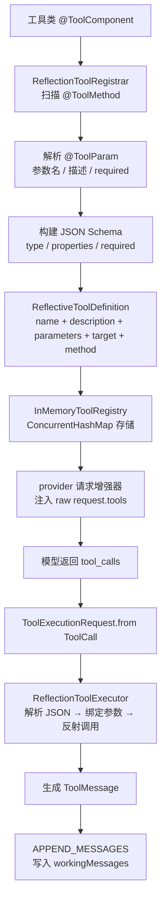

# liteagent-core

`liteagent-core` 是框架的统一抽象层。
只保留跨供应商稳定的基础模型和规范，不放任何协议私有字段。

## 职责

- 定义统一消息模型
- 定义统一请求抽象
- 定义统一结果抽象
- 定义工具注册与执行规范
- 定义框架基础异常

## 包结构

```text
io.github.halcyonsong.liteagent.core
├─ exception                    # 基础异常体系
├─ message
│  ├─ enums                     # 消息角色枚举
│  ├─ norm                      # 消息抽象接口
│  ├─ type                      # 具体消息类型
│  │  └─ constructor            # 消息工厂
│  └─ ...
├─ model
│  ├─ enums                     # 模型层枚举（FinishReason）
│  ├─ request
│  │  ├─ impl                   # 请求实现（ChatRequest）
│  │  └─ norm                   # 请求抽象（BaseRequest / Invocation / Advisor）
│  ├─ response
│  │  ├─ chat                   # 同步响应（Result / ChatChoice / ChatResponse）
│  │  ├─ norm                   # 响应抽象（BaseResponse / Usage / ResponseAdvisor）
│  │  └─ stream                 # 流式响应（StreamChoice / StreamDelta）
│  └─ tool                      # 工具调用模型（ToolCall / FunctionCall）
├─ support                      # JSON 工具
└─ tool
   ├─ annotation                # 工具注解（@ToolComponent / @ToolMethod / @ToolParam）
   ├─ impl                      # 工具实现（注册器 / 执行器 / 注册表）
   ├─ model                     # 工具执行请求
   └─ norm                      # 工具规范接口
```

## 核心类清单

### exception

| 类 | 说明 |
|---|---|
| `LiteAgentException` | 框架基础异常 |
| `ModelException` | 模型调用异常 |
| `ToolExecutionException` | 工具执行异常 |
| `ErrorCode` | 错误码枚举 |

### message

| 类 | 说明 |
|---|---|
| `Message` | 消息统一接口 |
| `AbstractMessage` | 消息基类（role + content） |
| `UserMessage` | 用户消息 |
| `AssistantMessage` | 助手消息 |
| `AssistantResponseMessage` | 助手响应消息（含 `reasoningContent`、`toolCalls`） |
| `SystemMessage` | 系统消息 |
| `ToolMessage` | 工具结果消息 |
| `Messages` | 消息工厂（快速构造各类型消息） |
| `MessageRole` | 消息角色枚举 |

### model.request

| 类 | 说明 |
|---|---|
| `BaseRequest` | 供应商级基础请求配置（baseUrl / apiKey / model） |
| `BaseOptions` | 生成参数标记接口 |
| `ChatRequest` | 聊天请求（消息列表 + 生成参数） |
| `Invocation` | 一次模型调用的统一入参抽象（BaseRequest + ChatRequest） |
| `RequestAdvisor` | 请求增强器接口 |

### model.response

| 类 | 说明 |
|---|---|
| `Result` | 聊天结果标记接口 |
| `BaseResponse` | 响应基础信息接口（id / object / created / model） |
| `Usage` | token 用量信息 |
| `ResponseAdvisor` | 响应增强器接口 |
| `ChatChoice` | 同步响应选项（index + chatResponse + finishReason） |
| `ChatResponse` | 同步响应消息集合 |
| `StreamChoice` | 流式响应选项（index + delta + finishReason） |
| `StreamDelta` | 流式增量（role + content + reasoningContent + toolCalls） |
| `FinishReason` | 完成原因枚举 |

### model.tool

| 类 | 说明 |
|---|---|
| `ToolCall` | 工具调用（index / id / type / function） |
| `FunctionCall` | 函数调用（name / arguments） |

### tool

| 类 | 说明 |
|---|---|
| `@ToolComponent` | 工具类注解（标记可被扫描注册的类） |
| `@ToolMethod` | 工具方法注解（name / description） |
| `@ToolParam` | 工具参数注解（name / description / required） |
| `ToolDefinition` | 工具定义接口 |
| `ExecutableToolDefinition` | 可执行工具定义（含 target / method） |
| `ToolRegistry` | 工具注册表接口 |
| `ToolRegistrar` | 工具注册器接口 |
| `ToolExecutor` | 工具执行器接口 |
| `InMemoryToolRegistry` | 内存注册表实现（ConcurrentHashMap） |
| `ReflectionToolRegistrar` | 反射注册器（扫描注解 → 构建定义） |
| `ReflectiveToolDefinition` | 反射工具定义实现 |
| `ReflectionToolExecutor` | 反射执行器（JSON → 参数绑定 → 反射调用） |
| `ToolRegistries` | 注册表工厂（inMemory 快捷入口） |
| `ToolExecutionRequest` | 工具执行请求（从 ToolCall 转换而来） |

### support

| 类 | 说明 |
|---|---|
| `JsonSupport` | JSON 序列化工具（toJson / toCompactJson） |

## 工具注册与执行链路



## 设计边界

core 不直接包含：

- OpenAI-compatible 协议字段（`tool_calls` 的 JSON 结构、`usage` 扩展字段等）
- 具体 HTTP 实现
- agent 编排步骤链
- 供应商私有请求 / 响应模型

这些内容留在 provider 或 provider-agent 层。
core 提供工具执行器（`ReflectionToolExecutor`）但不管编排调度。

## 注册规则

- 单个方法注册时，不要求类必须带 `@ToolComponent`
- 批量扫描注册时（`ToolRegistries.inMemory`），只扫描带 `@ToolComponent` 的类
- 方法参数默认通过反射获取名称（需 `-parameters` 编译）
- `@ToolParam.name()` 可覆盖反射结果
- `@ToolParam.required = false` 时，该参数不会进入 schema 的 required 列表
