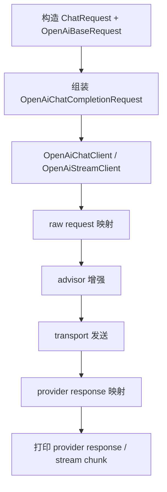

# liteagent-examples

`liteagent-examples` 是示例和手工验证模块。
它不属于框架核心打包内容，但可以使用 Spring Boot 配置能力做本地测试和 smoke test。

## 职责

- 演示 provider request 直接调用
- 演示流式 provider 调用
- 演示 provider 扩展字段读取
- 演示 tools 注入
- 演示 tool_choice 注入
- 演示本地配置拆分

## 当前范围

当前 examples 主要覆盖 `liteagent-provider-openai` 的 provider 直调链路。

也就是说，这里的测试重点仍然是：

- `OpenAiChatClient`
- `OpenAiStreamClient`
- `OpenAiQuickChatRequest`
- tools / tool_choice 请求增强

`liteagent-provider-openai-agent` 的最小编排入口已经在主仓库模块中存在，但 examples 还没有专门追加 agent smoke test。

## 当前主线流程



## 配置方式

示例通过 `application.yaml` 读取公共模板配置，再通过 `application-local.yaml` 覆盖真实本地值。

推荐形式：

```yaml
spring:
  config:
    import: optional:classpath:application-local.yaml
```

主配置保留模板字段：

```yaml
liteagent:
  openai:
    enabled: ${LITEAGENT_OPENAI_ENABLED:true}
    base-url: ${LITEAGENT_OPENAI_BASE_URL:https://api.siliconflow.cn/v1/chat/completions}
    api-key: ${LITEAGENT_OPENAI_API_KEY:your-api-key}
    model: ${LITEAGENT_OPENAI_MODEL:your-model}
    runtime:
      max-in-memory-size: ${LITEAGENT_OPENAI_MAX_IN_MEMORY_SIZE:16777216}
      connect-timeout-millis: ${LITEAGENT_OPENAI_CONNECT_TIMEOUT_MILLIS:5000}
      response-timeout-millis: ${LITEAGENT_OPENAI_RESPONSE_TIMEOUT_MILLIS:60000}
      stream-response-timeout-millis: ${LITEAGENT_OPENAI_STREAM_RESPONSE_TIMEOUT_MILLIS:300000}
```

副配置写真实值，并保持忽略提交。

## 推荐保留的示例类别

### provider

- `ProviderChatExampleTest`
- `ProviderReasoningExampleTest`
- `ProviderStreamExampleTest`
- `ProviderToolCallExampleTest`
- `QuickRequestChatExampleTest`

## 示例定位

这个模块更像一个“可运行文档”，不是最终业务代码。

适合做这些事：

- 验证接口是否还能正常调用
- 验证新特性是否按预期工作
- 作为仓库的调用模板
