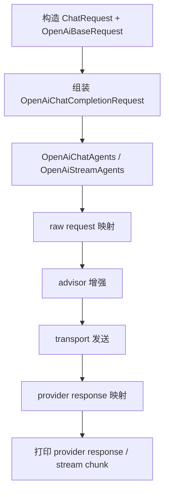
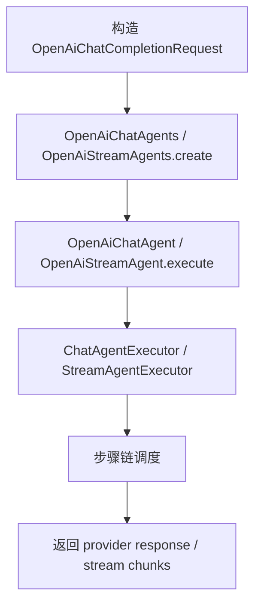

# liteagent-examples

`liteagent-examples` 是调用方式展示模块。
它不承担框架功能断言，重点是展示请求构造、Agent 创建、工具接入、流式消费和结果打印等完整调用链路。

## 职责

- 演示 provider request 直接调用
- 演示流式 provider 调用
- 演示 provider 扩展字段读取
- 演示 reasoning 模型调用
- 演示 tools 注入与 tool_choice
- 演示 chatAgent 同步编排（含多轮工具调用）
- 演示 streamAgent 流式编排（含多轮工具调用）
- 演示 Step Hook 用法
- 演示 QuickRequest 快捷构造
- 演示本地配置拆分

## 当前范围

当前 examples 覆盖 `liteagent-provider-openai-agent` 的 agent 编排入口，统一通过 `OpenAiChatAgents` / `OpenAiStreamAgents` 工厂创建 agent。

也就是说，这里的示例覆盖：

- `OpenAiChatAgent` / `OpenAiStreamAgent`（agent 编排，含工具调用回环）
- `OpenAiQuickChatRequest`（快捷请求构造）
- tools / tool_choice 请求增强
- Step Hook（before / after）
- 同步响应、流式 delta、reasoning、工具调用和 usage 的统一打印

## 当前主线流程

### OpenAI 请求调用



### agent 编排



## 配置方式

示例通过 `application.yaml` 读取公共模板配置，再通过 `application-local.yaml` 覆盖真实本地值。

推荐形式：

```yaml
spring:
  config:
    import: optional:classpath:application-local.yaml
```

主配置保留模板字段：

```yaml
liteagent:
  openai:
    enabled: ${LITEAGENT_OPENAI_ENABLED:true}
    base-url: ${LITEAGENT_OPENAI_BASE_URL:https://api.siliconflow.cn/v1/chat/completions}
    api-key: ${LITEAGENT_OPENAI_API_KEY:your-api-key}
    model: ${LITEAGENT_OPENAI_MODEL:your-model}
    runtime:
      max-in-memory-size: ${LITEAGENT_OPENAI_MAX_IN_MEMORY_SIZE:16777216}
      connect-timeout-millis: ${LITEAGENT_OPENAI_CONNECT_TIMEOUT_MILLIS:5000}
      response-timeout-millis: ${LITEAGENT_OPENAI_RESPONSE_TIMEOUT_MILLIS:60000}
      stream-response-timeout-millis: ${LITEAGENT_OPENAI_STREAM_RESPONSE_TIMEOUT_MILLIS:300000}
```

副配置写真实值，并保持忽略提交。

## 推荐保留的示例类别

### provider 直调

- `ProviderChatExampleTest` — 普通对话调用
- `ProviderReasoningExampleTest` — reasoning 模型调用
- `ProviderStreamExampleTest` — 流式对话调用
- `ProviderToolCallExampleTest` — 工具注入与 tool_choice
- `QuickRequestChatExampleTest` — QuickRequest 快捷构造

### agent 编排

- `ChatAgentExampleTest` — chatAgent 同步编排
- `StreamAgentExampleTest` — streamAgent 流式编排
- `ChatAgentToolCallExampleTest` — chatAgent 多轮工具调用
- `StreamAgentToolCallExampleTest` — streamAgent 多轮工具调用
- `AgentHookExampleTest` — Step Hook 用法（chat + stream）

### QuickRequest 流式

- `ProviderQuickRequestStreamExampleTest` — QuickRequest 流式调用

## 示例定位

这个模块更像一个"可运行文档"，不是最终业务代码，也不是框架功能测试模块。

适合做这些事：

- 查找某种调用方式的最小完整示例
- 复制请求构造、Agent 创建和结果消费代码
- 观察普通输出、reasoning、工具调用和流式响应的打印效果
