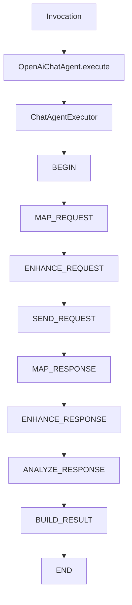
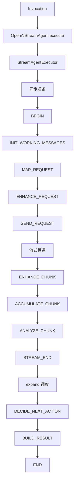

# liteagent-provider-openai-agent

`liteagent-provider-openai-agent` 是 OpenAI provider 的编排接入层。
它把 `liteagent-provider-openai` 已有的 request mapper、advisor、transport、response mapper 装配成可执行步骤链。

## 职责

- 提供 OpenAI chatAgent 门面（同步）
- 提供 OpenAI streamAgent 门面（流式）
- 提供 chatAgent / streamAgent 执行器工厂
- 提供 OpenAI provider 的同步步骤链和流式步骤链

## 包结构

```text
io.github.halcyonsong.liteagent.provider.openai.agent
├─ chat                        # 同步编排实现
│  ├─ constant
│  ├─ factory
│  └─ step
│     ├─ request
│     └─ response
├─ stream                      # 流式编排实现
│  ├─ constant
│  ├─ factory
│  ├─ state
│  ├─ step
│  │  ├─ request
│  │  └─ response
│  └─ support
├─ OpenAiChatAgent             # 同步门面
└─ OpenAiStreamAgent           # 流式门面
```

## chat 编排主线（同步）



## stream 编排主线（流式）



## 已实现内容

### chat 路径（同步）

- `OpenAiChatAgent` — 门面
- `OpenAiChatAgents` — 工厂入口（支持 WebClient / HttpRuntimeConfig）
- `OpenAiChatAgentExecutorFactory` — 执行器装配
- `OpenAiChatBeginStep` — 初始化
- `OpenAiChatMapRequestStep` — 请求映射
- `OpenAiChatEnhanceRequestStep` — 请求增强（advisor + stream=false）
- `OpenAiChatSendRequestStep` — 发送 HTTP 请求
- `OpenAiChatMapResponseStep` — 响应映射
- `OpenAiChatEnhanceResponseStep` — 响应增强
- `OpenAiChatAnalyzeResponseStep` — 分析响应
- `OpenAiChatBuildResultStep` — 构建结果

### stream 路径（流式）

- `OpenAiStreamAgent` — 门面
- `OpenAiStreamAgents` — 工厂入口（支持 WebClient / HttpRuntimeConfig）
- `OpenAiStreamAgentExecutorFactory` — 执行器装配
- `OpenAiStreamBeginStep` — 初始化（判断是否需要初始化消息）
- `OpenAiStreamInitWorkingMessagesStep` — 复制 invocation 消息到 workingMessages
- `OpenAiStreamMapRequestStep` — 基于 workingMessages 构建请求
- `OpenAiStreamEnhanceRequestStep` — 请求增强（advisor + stream=true）
- `OpenAiStreamSendRequestStep` — 发起流式请求，创建源流
- `OpenAiStreamEnhanceChunkStep` — 对每个 chunk 应用 advisor
- `OpenAiStreamAccumulateChunkStep` — 累积 chunk 到 accumulator
- `OpenAiStreamAnalyzeChunkStep` — 标记轮次完成
- `OpenAiStreamDecideNextActionStep` — 决策下一步（当前恒返回 BUILD_RESULT）
- `OpenAiStreamExecuteToolStep` — 工具执行（当前返回 END）
- `OpenAiStreamBuildResultStep` — 构建结果
- `OpenAiStreamRoundAccumulator` — 单轮流式累积器
- `OpenAiStreamRoundSupport` — 累积器获取工具

## 当前范围

当前这个模块已经实现：

- 同步 chat 编排完整闭环
- 流式 stream 编排最小链路（单轮）
- 请求增强器（request advisor / response advisor）
- 流式 chunk 累积

还未实现：

- 工具自动执行闭环（DECIDE_NEXT_ACTION 恒返回 BUILD_RESULT）
- 多轮流式编排（EXECUTE_TOOL 为占位实现）
- 流式 chunk delta 合并（当前只收集不合并）
