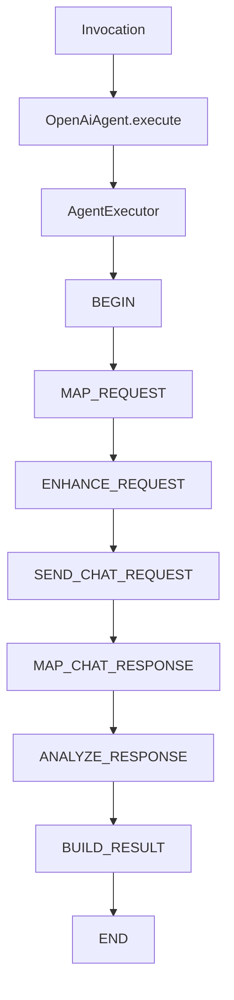

# liteagent-provider-openai-chatAgent

`liteagent-provider-openai-chatAgent` 是 OpenAI provider 的编排接入层。
它把 `liteagent-provider-openai` 已有的 request mapper、advisor、transport、response mapper 装配成可执行步骤链。

## 职责

- 提供 OpenAI chatAgent 门面
- 提供 OpenAI chatAgent 执行器工厂
- 提供 OpenAI chatAgent 自动装配入口
- 提供 OpenAI provider 的最小同步步骤链

## 包结构

```text
io.github.halcyonsong.liteagent.provider.openai.chatAgent
├─ constant
├─ factory
└─ step
   ├─ request
   └─ response
```

## 当前主线



## 已实现内容

- `OpenAiChatAgent`
- `OpenAiChatAgents`
- `OpenAiChatAgentExecutorFactory`
- `OpenAiChatBeginStep`
- `OpenAiChatMapRequestStep`
- `OpenAiChatEnhanceRequestStep`
- `OpenAiChatSendRequestStep`
- `OpenAiChatMapResponseStep`
- `OpenAiChatAnalyzeResponseStep`
- `OpenAiChatBuildResultStep`

## 当前范围

当前这个模块解决的是“把单轮 OpenAI provider 调用拆成节点并交给执行器调度”。

它还没有解决：

- 工具自动执行闭环
- 多轮调用回环
- 流式 chatAgent 编排
- 响应增强器

所以当前它更接近“最小可编排骨架”，而不是完整 chatAgent runtime。
