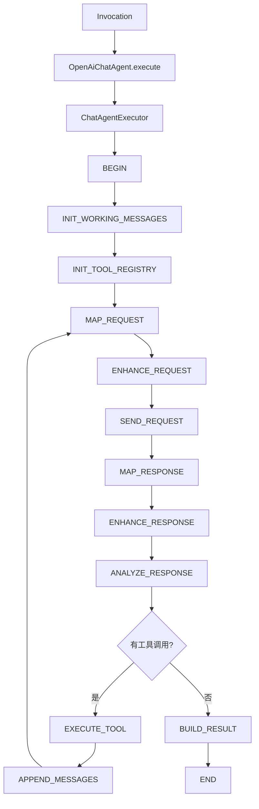
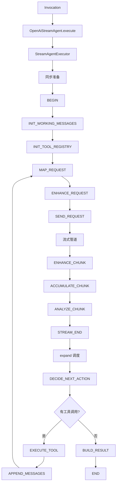

# liteagent-provider-openai-agent

`liteagent-provider-openai-agent` 是 OpenAI provider 的编排接入层。
它把 `liteagent-provider-openai` 已有的 request mapper、advisor、transport、response mapper 装配成可执行步骤链。

## 职责

- 提供 OpenAI chatAgent 门面（同步）
- 提供 OpenAI streamAgent 门面（流式）
- 提供 chatAgent / streamAgent 执行器工厂
- 提供 OpenAI provider 的同步步骤链和流式步骤链

## 包结构

```text
io.github.halcyonsong.liteagent.provider.openai.agent
├─ chat                        # 同步编排实现
│  ├─ constant
│  ├─ factory
│  └─ step
│     ├─ request
│     └─ response
├─ stream                      # 流式编排实现
│  ├─ constant
│  ├─ factory
│  ├─ state
│  ├─ step
│  │  ├─ request
│  │  └─ response
│  └─ support
├─ OpenAiChatAgent             # 同步门面
└─ OpenAiStreamAgent           # 流式门面
```

## chat 编排主线（同步，含工具回环）



## stream 编排主线（流式，含工具回环）



## 已实现内容

### chat 路径（同步）

- `OpenAiChatAgent` — 门面
- `OpenAiChatAgents` — 工厂入口（支持 WebClient / HttpRuntimeConfig）
- `OpenAiChatAgentExecutorFactory` — 执行器装配
- `OpenAiChatBeginStep` — 初始化
- `OpenAiChatInitWorkingMessagesStep` — 复制 invocation 消息到 workingMessages
- `OpenAiChatInitToolRegistryStep` — 从 request advisor 提取 ToolRegistry
- `OpenAiChatMapRequestStep` — 请求映射
- `OpenAiChatEnhanceRequestStep` — 请求增强（advisor + stream=false）
- `OpenAiChatSendRequestStep` — 发送 HTTP 请求
- `OpenAiChatMapResponseStep` — 响应映射
- `OpenAiChatEnhanceResponseStep` — 响应增强
- `OpenAiChatAnalyzeResponseStep` — 分析响应，路由到 EXECUTE_TOOL 或 BUILD_RESULT
- `OpenAiChatExecuteToolStep` — 执行工具调用，生成 assistant + tool 消息
- `OpenAiChatAppendMessagesStep` — 追加暂存消息到 workingMessages，决定下一轮或结束
- `OpenAiChatBuildResultStep` — 构建结果

### stream 路径（流式）

- `OpenAiStreamAgent` — 门面
- `OpenAiStreamAgents` — 工厂入口（支持 WebClient / HttpRuntimeConfig）
- `OpenAiStreamAgentExecutorFactory` — 执行器装配
- `OpenAiStreamBeginStep` — 初始化（判断是否需要初始化消息）
- `OpenAiStreamInitWorkingMessagesStep` — 复制 invocation 消息到 workingMessages
- `OpenAiStreamInitToolRegistryStep` — 从 request advisor 提取 ToolRegistry
- `OpenAiStreamMapRequestStep` — 基于 workingMessages 构建请求
- `OpenAiStreamEnhanceRequestStep` — 请求增强（advisor + stream=true）
- `OpenAiStreamSendRequestStep` — 发起流式请求，创建源流
- `OpenAiStreamEnhanceChunkStep` — 对每个 chunk 应用 advisor
- `OpenAiStreamAccumulateChunkStep` — 累积 chunk 到 accumulator
- `OpenAiStreamAnalyzeChunkStep` — 分析 chunk，检测 finishReason 标记轮次完成
- `OpenAiStreamDecideNextActionStep` — 决策下一步，路由到 EXECUTE_TOOL 或 BUILD_RESULT
- `OpenAiStreamExecuteToolStep` — 执行工具调用，生成 assistant + tool 消息
- `OpenAiStreamAppendMessagesStep` — 追加暂存消息到 workingMessages，决定下一轮或结束
- `OpenAiStreamBuildResultStep` — 构建结果
- `OpenAiStreamRoundAccumulator` — 单轮流式累积器（按 choice.index / toolCall.index 合并 delta）

## 当前范围

当前这个模块已经实现：

- 同步 chat 编排完整闭环（含多轮工具调用回环）
- 流式 stream 编排完整闭环（含多轮工具调用回环）
- 请求增强器（request advisor / response advisor）
- 流式 chunk delta 合并（`OpenAiStreamRoundAccumulator`）
- 工具自动执行（`ReflectionToolExecutor`，通过 `ToolRegistrySupport` 提取 registry）
- `maxIterations` 保护（默认 10，防止无限工具回环）
- Step Hook 支持（before / after / error）

还未实现：

- Spring 自动装配增强
- 更多 provider 适配
