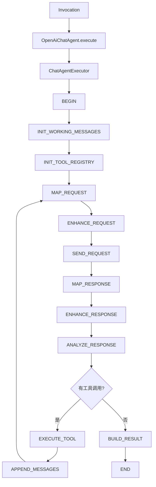
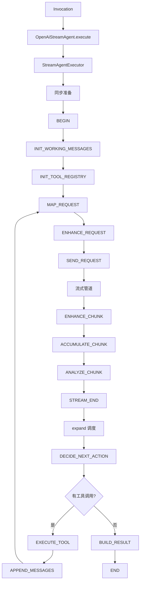

# liteagent-provider-openai-agent

`liteagent-provider-openai-agent` 是 OpenAI provider 的编排接入层。
它把 `liteagent-provider-openai` 已有的 request mapper、advisor、transport、response mapper 装配成可执行步骤链。

## 职责

- 提供 OpenAI chatAgent 门面（同步）
- 提供 OpenAI streamAgent 门面（流式）
- 提供 chatAgent / streamAgent 执行器工厂
- 提供 OpenAI provider 的同步步骤链和流式步骤链
- 提供 step hook、maxIterations、maxStepCount 配置

## 包结构

```text
io.github.halcyonsong.liteagent.provider.openai.agent
├─ chat                        # 同步编排实现
│  ├─ factory                  # 执行器工厂 + 自动装配入口
│  └─ step
│     ├─ request               # 请求阶段步骤（BEGIN → SEND_REQUEST）
│     └─ response              # 响应阶段步骤（MAP_RESPONSE → END）
├─ stream                      # 流式编排实现
│  ├─ factory                  # 执行器工厂 + 自动装配入口
│  ├─ state                    # 流式累积器
│  ├─ step
│  │  ├─ request               # 请求阶段步骤（BEGIN → SEND_REQUEST）
│  │  └─ response              # 响应阶段步骤（ENHANCE_CHUNK → END）
│  └─ support                  # 流式轮次/工具调用辅助
├─ constant                    # 上下文属性键常量
└─ support                     # 请求构建/工具执行辅助
```

## chat 编排主线（同步，含工具回环）



END 步骤在主循环退出后单独执行，用于收尾日志或清理。

## stream 编排主线（流式，含工具回环）



END 步骤在每轮 BUILD_RESULT 后单独执行。

## 核心类清单

### chat 路径（同步）

| 类 | 包 | 说明 |
|---|---|---|
| `OpenAiChatAgent` | `chat` | 同步门面，返回 `OpenAiChatCompletionResponse` |
| `OpenAiChatAgents` | `chat.factory` | 自动装配入口（WebClient / HttpRuntimeConfig / WebClientRegistry） |
| `OpenAiChatAgentExecutorFactory` | `chat.factory` | 步骤装配器，组装 13 个 chat step |

#### chat.step.request

| 类 | 说明 |
|---|---|
| `OpenAiChatBeginStep` | 初始化，路由到 INIT_WORKING_MESSAGES 或 INIT_TOOL_REGISTRY |
| `OpenAiChatInitWorkingMessagesStep` | 复制 invocation 消息到 workingMessages |
| `OpenAiChatInitToolRegistryStep` | 从 request advisor 提取 ToolRegistry |
| `OpenAiChatMapRequestStep` | 请求映射（provider request → raw request） |
| `OpenAiChatEnhanceRequestStep` | 请求增强（advisor + stream=false） |
| `OpenAiChatSendRequestStep` | 发送 HTTP 请求 |

#### chat.step.response

| 类 | 说明 |
|---|---|
| `OpenAiChatMapResponseStep` | 响应映射（raw response → provider response） |
| `OpenAiChatEnhanceResponseStep` | 响应增强 |
| `OpenAiChatAnalyzeResponseStep` | 分析响应，路由到 EXECUTE_TOOL 或 BUILD_RESULT |
| `OpenAiChatExecuteToolStep` | 执行工具调用，生成 assistant + tool 消息 |
| `OpenAiChatAppendMessagesStep` | 追加暂存消息到 workingMessages |
| `OpenAiChatBuildResultStep` | 构建结果 |
| `OpenAiChatEndStep` | 收尾步骤（日志、清理） |

### stream 路径（流式）

| 类 | 包 | 说明 |
|---|---|---|
| `OpenAiStreamAgent` | `stream` | 流式门面，返回 `Flux<OpenAiStreamCompletionResponse>` |
| `OpenAiStreamAgents` | `stream.factory` | 自动装配入口（WebClient / HttpRuntimeConfig / WebClientRegistry） |
| `OpenAiStreamAgentExecutorFactory` | `stream.factory` | 步骤装配器，组装 15 个 stream step |
| `OpenAiStreamRoundAccumulator` | `stream.state` | 单轮流式累积器（按 choice.index / toolCall.index 合并 delta） |

#### stream.step.request

| 类 | 说明 |
|---|---|
| `OpenAiStreamBeginStep` | 初始化，路由到 INIT_WORKING_MESSAGES 或 INIT_TOOL_REGISTRY |
| `OpenAiStreamInitWorkingMessagesStep` | 复制 invocation 消息到 workingMessages |
| `OpenAiStreamInitToolRegistryStep` | 从 request advisor 提取 ToolRegistry |
| `OpenAiStreamMapRequestStep` | 基于 workingMessages 构建请求 |
| `OpenAiStreamEnhanceRequestStep` | 请求增强（advisor + stream=true） |
| `OpenAiStreamSendRequestStep` | 发起流式请求，创建源流 |

#### stream.step.response

| 类 | 说明 |
|---|---|
| `OpenAiStreamEnhanceChunkStep` | 对每个 chunk 应用 advisor |
| `OpenAiStreamAccumulateChunkStep` | 累积 chunk 到 accumulator |
| `OpenAiStreamAnalyzeChunkStep` | 分析 chunk，检测 finishReason 标记轮次完成 |
| `OpenAiStreamDecideNextActionStep` | 决策下一步，路由到 EXECUTE_TOOL 或 BUILD_RESULT |
| `OpenAiStreamExecuteToolStep` | 执行工具调用，生成 assistant + tool 消息 |
| `OpenAiStreamAppendMessagesStep` | 追加暂存消息到 workingMessages |
| `OpenAiStreamBuildResultStep` | 构建结果 |
| `OpenAiStreamEndStep` | 收尾步骤（日志、清理） |

### stream.support

| 类 | 说明 |
|---|---|
| `OpenAiStreamRoundSupport` | 流式轮次辅助（accumulator 创建、轮次状态读取） |
| `OpenAiStreamToolCallSupport` | 流式工具调用解析（从 accumulator 提取 toolCalls） |

### constant

| 类 | 说明 |
|---|---|
| `OpenAiAgentAttributes` | 上下文属性键常量（PROVIDER_REQUEST / RAW_REQUEST / RAW_RESPONSE / TOOL_EXECUTION_REQUESTS） |

### support

| 类 | 说明 |
|---|---|
| `OpenAiAgentRequestSupport` | 请求读取辅助（provider request / raw request 读取、endpoint / apiKey 解析） |
| `OpenAiAgentRequestBuildSupport` | 请求构建辅助（基于 workingMessages 构建 raw request） |
| `OpenAiToolCallSupport` | 工具调用解析（从 chat 响应提取 toolCalls / 工具执行请求） |
| `OpenAiToolExecutionSupport` | 工具执行辅助（调用 ToolExecutor，结果转 ToolMessage） |
| `ToolRegistrySupport` | 从 invocation 的 advisor 中提取 ToolRegistry |

## 当前范围

已实现：

- 同步 chat 编排完整闭环（含多轮工具调用回环）
- 流式 stream 编排完整闭环（含多轮工具调用回环）
- 请求增强器（request advisor / response advisor）
- 流式 chunk delta 合并（`OpenAiStreamRoundAccumulator`）
- 工具自动执行（`ReflectionToolExecutor`，通过 `ToolRegistrySupport` 提取 registry）
- `maxIterations` 保护（默认 10，可通过工厂方法配置）
- `maxStepCount` 保护（默认 1000，可通过工厂方法配置）
- Step Hook 支持（before / after / error）
- END 步骤收尾（chat 在主循环外执行，stream 在每轮 BUILD_RESULT 后执行）

还未实现：

- Spring 自动装配增强
- 更多 provider 适配
