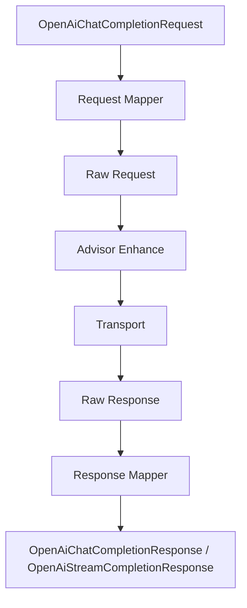

# liteagent-provider-openai

`liteagent-provider-openai` 是 OpenAI-compatible 协议实现层。
这里负责把 provider request 映射成 OpenAI-compatible raw 协议，再把 raw 协议映射回 provider 响应。

## 职责

- 将 provider request 映射为 raw request
- 将 raw response 映射为 provider response
- 提供普通 client 和流式 client
- 提供 runtime 配置和 WebClient 复用
- 提供 tools / tool_choice 请求增强

## 包结构

```text
io.github.halcyonsong.liteagent.provider.openai
├─ client
├─ request
│  ├─ advisor
│  ├─ config
│  │  └─ tool
│  ├─ mapper
│  ├─ quickrequest
│  └─ raw
├─ response
│  ├─ mapper
│  └─ config
│     ├─ chat
│     ├─ stream
│     └─ tool
├─ runtime
│  ├─ config
│  └─ register
├─ support
└─ transport
```

## provider 调用主线



## 已实现内容

### request

- `OpenAiBaseRequest`
- `OpenAiChatCompletionRequest`
- `OpenAiCompletionOptions`
- `OpenAiQuickChatRequest`
- `OpenAiChatCompletionRawRequest`
- `OpenAiChatRequestMapper`
- `OpenAiRegistryToolsAdvisor`
- `OpenAiToolChoiceAdvisor`

### response

普通响应：

- `OpenAiBaseResponse`
- `OpenAiUsage`
- `OpenAiChatCompletionResponse`
- `OpenAiChatResponseMapper`（映射到 core 层 `AssistantResponseMessage`，含 `reasoningContent` 和 `toolCalls`）

流式响应：

- `OpenAiStreamCompletionResponse`
- `OpenAiStreamResponseMapper`

### runtime

- `HttpRuntimeConfig`
- `HttpRuntimeKey`
- `HttpRuntimeMode`
- `WebClientFactory`
- `WebClientRegistry`

### client / transport

普通调用：

- `OpenAiChatClient`
- `OpenAiChatTransport`

流式调用：

- `OpenAiStreamClient`
- `OpenAiChatStreamTransport`

快捷构造：

- `OpenAiChatClientFactory`
- `OpenAiClients`

## 当前设计

### 1. wrapper request / raw request 分离

wrapper request 面向开发者，raw request 面向协议发送。

### 2. raw response / wrapper response 分离

远端返回先进入 raw response，再映射为 provider response。

### 3. 普通请求与流式请求分离

普通和流式由不同 client / transport 处理：

- `OpenAiChatClient`
- `OpenAiStreamClient`

### 4. tools / tool_choice 注入发生在发送前


说明：

- `ToolRegistry` 先负责保存可用工具定义
- `OpenAiRegistryToolsAdvisor` 再把 registry 里的工具注入 raw request，同时作为 agent 提取 registry 的载体
- `OpenAiToolChoiceAdvisor` 再补充工具选择策略
- 工具执行闭环由 `liteagent-provider-openai-agent` 模块实现

## 当前限制

当前还没有完成：

- Spring 自动装配增强
- 更多 provider 适配
- 更完整的异常细分与重试策略
- 更细粒度的 provider 配置抽象
