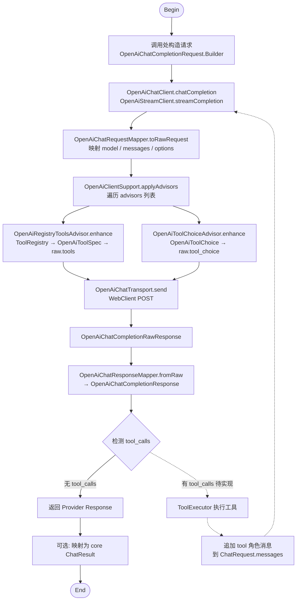

# liteagent-provider-openai

`liteagent-provider-openai` 是 OpenAI-compatible 协议实现层。
这里负责把 core 模型映射成 OpenAI-compatible raw 协议，再把 raw 协议映射回 provider 响应和 core 响应。

## 职责

- 将 core request 映射为 raw request
- 将 raw response 映射为 provider response
- 将 provider response 再映射为 core response
- 提供普通 client 和流式 client
- 提供 runtime 配置和 WebClient 复用
- 提供 tools / tool_choice 请求增强

## 包结构

```text
io.github.halcyonsong.liteagent.provider.openai
├─ client
├─ request
│  ├─ advisor
│  ├─ config
│  │  └─ tool
│  ├─ mapper
│  ├─ quickrequest
│  └─ raw
├─ response
│  ├─ mapper
│  └─ config
│     ├─ chat
│     ├─ stream
│     └─ tool
├─ runtime
│  ├─ config
│  └─ register
├─ support
└─ transport
```

## 已实现内容

### request

- `OpenAiBaseRequest`
- `OpenAiChatCompletionRequest`
- `OpenAiCompletionOptions`
- `OpenAiQuickChatRequest`
- `OpenAiChatCompletionRawRequest`
- `OpenAiChatRequestMapper`
- `OpenAiRegistryToolsAdvisor`
- `OpenAiToolChoiceAdvisor`

### response

普通响应：

- `OpenAiBaseResponse`
- `OpenAiUsage`
- `OpenAiChatCompletionResponse`
- `OpenAiAssistantMessage`
- `OpenAiToolCall`
- `OpenAiFunctionCall`
- `OpenAiChatResponseMapper`

流式响应：

- `OpenAiStreamCompletionResponse`
- `OpenAiStreamResponseMapper`

### runtime

- `HttpRuntimeConfig`
- `HttpRuntimeKey`
- `WebClientFactory`
- `WebClientRegistry`

### client / transport

普通调用：

- `OpenAiChatClient`
- `OpenAiChatTransport`

流式调用：

- `OpenAiStreamClient`
- `OpenAiChatStreamTransport`

快捷构造：

- `OpenAiChatClientFactory`
- `OpenAiClients`

## 当前设计

### 1. raw request / wrapper request 分离

wrapper request 面向开发者，raw request 面向协议发送。

### 2. raw response / wrapper response 分离

远端返回先进入 raw response，再映射为 provider response。

### 3. 普通请求与流式请求分离

普通和流式由不同 client / transport 处理：

- `OpenAiChatClient`
- `OpenAiStreamClient`

这样返回类型和调用语义更清楚。

### 4. tools / tool_choice 注入发生在发送前

完整的请求-响应-工具调用链路：



说明：

- 实线部分为当前已实现的链路
- 虚线部分为工具执行闭环，尚未实现
- `OpenAiChatRequestMapper` 只做基本字段映射，不处理 tools / tool_choice
- tools 和 tool_choice 完全由 Advisor 机制注入，与对话逻辑解耦
- Advisor 按 Builder 中 `.advisor()` 调用顺序执行
- 流式调用（`OpenAiStreamClient`）在同一位置执行 Advisor，仅 transport 和响应类型不同

### 5. 普通与流式超时分离

运行时配置支持：

- 普通请求超时
- 流式请求超时

流式超时可以单独配置，不需要和普通请求绑死。

## 使用说明

### 普通调用

- `ChatInvocation -> ChatResult`
- `OpenAiChatCompletionRequest -> OpenAiChatCompletionResponse`
- `OpenAiQuickChatRequest -> OpenAiChatCompletionResponse`

### 流式调用

- `ChatInvocation -> Flux<StreamChunk>`
- `OpenAiChatCompletionRequest -> Flux<OpenAiStreamCompletionResponse>`
- `OpenAiQuickChatRequest -> Flux<OpenAiStreamCompletionResponse>`

## 当前限制

当前还没有完成：

- 工具自动执行闭环
- 更完整的异常细分
- Spring 自动装配增强
- 更细粒度的 provider 配置抽象
