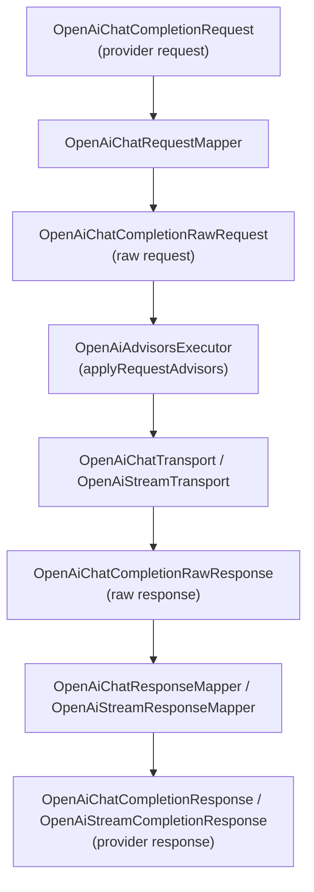
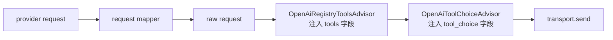
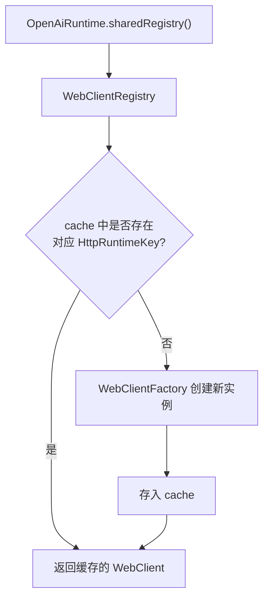

# liteagent-provider-openai

`liteagent-provider-openai` 是 OpenAI-compatible 协议实现层。
负责把 provider request 映射成 OpenAI-compatible raw 协议，再把 raw response 映射回 provider 响应。

## 职责

- 将 provider request 映射为 raw request
- 将 raw response 映射为 provider response
- 提供 runtime 配置和 WebClient 复用
- 提供 tools / tool_choice 请求增强
- 提供 HTTP transport（同步 + 流式）

## 包结构

```text
io.github.halcyonsong.liteagent.provider.openai
├─ advisor                    # 请求增强器（tools / tool_choice 注入）
├─ request
│  ├─ config                  # 请求配置（BaseRequest / CompletionRequest / Options）
│  │  └─ tool                 # 工具协议模型（FunctionSpec / ToolSpec / ToolChoice）
│  ├─ mapper                  # 请求映射器（provider request → raw request）
│  ├─ quickrequest            # 快速构造入口
│  └─ raw                     # raw 协议请求体
├─ response
│  ├─ config                  # 响应配置（BaseResponse / Usage / ChatResponse / StreamResponse）
│  │  ├─ chat                 # 同步响应模型
│  │  └─ stream               # 流式响应模型
│  ├─ mapper                  # 响应映射器（raw response → provider response）
│  └─ raw                     # raw 协议响应体
├─ runtime
│  ├─ config                  # 运行时配置（HttpRuntimeConfig / Key / Mode）
│  └─ register                # WebClient 注册表与工厂
├─ support                    # 增强器执行器、端点解析
└─ transport                  # HTTP 传输层（同步 + 流式）
```

## provider 请求映射主线



## 核心类清单

### advisor

| 类 | 说明 |
|---|---|
| `OpenAiRegistryToolsAdvisor` | 从 ToolRegistry 提取工具定义，注入 raw request 的 tools 字段 |
| `OpenAiToolChoiceAdvisor` | 注入 tool_choice 字段，控制工具选择策略 |

### request.config

| 类 | 说明 |
|---|---|
| `OpenAiBaseRequest` | provider 级基础请求（baseUrl / apiKey / model） |
| `OpenAiChatCompletionRequest` | provider 级编排输入（BaseRequest + ChatRequest + Options + Advisors），实现 `Invocation` |
| `OpenAiCompletionOptions` | OpenAI 协议扩展参数（temperature / maxTokens / topP 等） |

### request.config.tool

| 类 | 说明 |
|---|---|
| `OpenAiFunctionSpec` | 函数定义（name / description / parameters JSON Schema） |
| `OpenAiToolSpec` | 工具条目（type=function + function spec） |
| `OpenAiToolChoice` | 工具选择策略（none / auto / specific function） |

### request.mapper

| 类 | 说明 |
|---|---|
| `OpenAiChatRequestMapper` | 将 `OpenAiChatCompletionRequest` 映射为 `OpenAiChatCompletionRawRequest` |
| `OpenAiToolSpecResolver` | 将 core `ToolDefinition` 转换为 provider `OpenAiToolSpec` |

### request.quickrequest

| 类 | 说明 |
|---|---|
| `OpenAiQuickChatRequest` | 快速构造入口（baseUrl + apiKey + model + userMessage + systemMessage） |

### request.raw

| 类 | 说明 |
|---|---|
| `OpenAiChatCompletionRawRequest` | OpenAI-compatible 协议请求体（直接序列化为 HTTP body） |

### response.config

| 类 | 说明 |
|---|---|
| `OpenAiBaseResponse` | 响应基础信息（id / object / created / model） |
| `OpenAiUsage` | token 用量（promptTokens / completionTokens / totalTokens） |
| `OpenAiChatCompletionResponse` | 同步响应（含 content / reasoningContent / toolCalls） |
| `OpenAiStreamCompletionResponse` | 流式响应增量（含 delta content / reasoningContent / toolCalls） |

### response.raw

| 类 | 说明 |
|---|---|
| `OpenAiChatCompletionRawResponse` | OpenAI-compatible 协议原始响应体 |

### response.mapper

| 类 | 说明 |
|---|---|
| `OpenAiChatResponseMapper` | 将 raw response 映射为 `AssistantResponseMessage` |
| `OpenAiStreamResponseMapper` | 将 raw stream chunk 映射为 `OpenAiStreamCompletionResponse` |
| `OpenAiResponseMappingSupport` | 共享映射逻辑（普通 + 流式复用） |

### runtime.config

| 类 | 说明 |
|---|---|
| `HttpRuntimeConfig` | HTTP 运行时配置（maxInMemorySize / connectTimeout / responseTimeout / streamTimeout） |
| `HttpRuntimeKey` | WebClient 缓存键（配置 + 模式的组合） |
| `HttpRuntimeMode` | 运行时模式枚举（CHAT / STREAM） |

### runtime.register

| 类 | 说明 |
|---|---|
| `OpenAiRuntime` | 全局共享入口（持有唯一 `WebClientRegistry`，提供静态快捷方法） |
| `WebClientRegistry` | WebClient 注册表（按 `HttpRuntimeKey` 缓存复用） |
| `WebClientFactory` | WebClient 工厂（创建 chat / stream 两种客户端） |

### support

| 类 | 说明 |
|---|---|
| `OpenAiAdvisorsExecutor` | 增强器执行器（批量应用 request / response advisors） |
| `OpenAiEndpointResolver` | 端点解析器（baseUrl → 完整 API endpoint） |

### transport

| 类 | 说明 |
|---|---|
| `OpenAiChatTransport` | 同步 HTTP 请求发送器（WebClient.post → block） |
| `OpenAiStreamTransport` | 流式 HTTP 请求发送器（WebClient.post → SSE Flux） |

## tools / tool_choice 注入流程



- `OpenAiRegistryToolsAdvisor` 从 `ToolRegistry` 提取工具定义，通过 `OpenAiToolSpecResolver` 转换为 `OpenAiToolSpec`，注入 raw request
- `OpenAiToolChoiceAdvisor` 补充 tool_choice 策略（auto / none / 指定函数）
- 工具执行闭环由 `liteagent-provider-openai-agent` 模块实现

## 设计边界

本模块不包含：

- agent 编排步骤链
- 工具执行器实现
- 多轮工具调用调度

这些内容由 `liteagent-provider-openai-agent` 模块负责。
本模块只提供协议适配、HTTP 传输和请求/响应映射。

## WebClient 复用机制



- `HttpRuntimeKey` 由 `HttpRuntimeConfig` + `HttpRuntimeMode` 组合而成
- chat 和 stream 使用不同的 mode，因此同一个配置会产生两个独立的 WebClient
- 非 Spring 场景直接使用 `OpenAiRuntime` 静态方法；Spring 场景可自行注入 `WebClientRegistry` Bean
